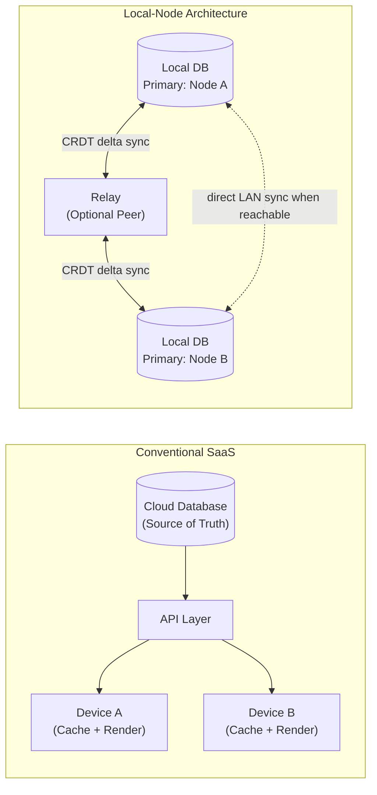
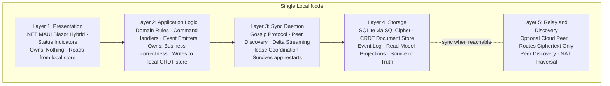

# Chapter 3 - The Inverted Stack in One Diagram

<!-- icm/voice-check -->

<!-- Target: ~3,500 words -->
<!-- Source: v13 §5, Executive Summary comparison table; v5 §2, §2.1, §2.2 -->

---

## The Inversion in One Sentence

Every architectural decision in this book follows from one reversal of priority:

> **Conventional SaaS:** Cloud database is primary — local device caches and renders.  
> **Local-Node Architecture:** Local node is primary — cloud relay is an optional sync peer.

In the conventional model, the local device is a thin client. It renders what the server says to render. It writes what the server accepts. Remove the server and the device has nothing — a shell waiting for instructions that will not arrive.

In the local-node model, the device *is* the server. The local encrypted database holds the authoritative copy of the user's data. When peers are reachable, the node exchanges state with them. When no peers are reachable, the node operates at full fidelity. The node has no degraded mode — with one exception: CP-class records that require distributed lease coordination, covered later in this chapter. It carries no dependency on any remote service for core function.

The architecture resolves into one mental model anchored by the principal diagram below.

The relay is optional. Two nodes on the same LAN sync directly via mDNS peer discovery, with no relay in the path. The relay exists to help nodes find each other across NAT boundaries, not to hold their data. If the relay goes down, nodes fall back to direct peer-to-peer communication on the local network. If that also fails, they work offline and catch up when connectivity returns.

This is the inversion. Everything else is implementation.

---

## The Five Layers

The inversion is one sentence. The five-layer model is why that sentence is implementable — the specific form the architecture takes when each property of the SaaS bundle is delivered without vendor data custody. Each layer has a clear owner, a clear boundary, and an answer to the question every distributed system must answer: what happens when the network is unavailable?

### Layer 1: Presentation

The presentation layer renders what the local store contains. It owns no state, caches nothing independently, and makes no decisions about data.

In the Zone A accelerator (the Anchor pattern), this layer is a .NET MAUI Blazor Hybrid shell: a native application window embedding a Blazor WebView that renders Razor components backed by local data. The component surface is identical to the Zone C accelerator (the comms mesh pattern) browser shell. The same `Harborline.UICore` and `Harborline.UIAdapters.Blazor` components render whether the node is a local desktop installation or a hosted tenant instance. A UI component that only works against a cloud backend has not been designed correctly for this architecture.

The presentation layer's primary local-first responsibility is status indication. The `SunfishNodeHealthBar` component (`Harborline.UIAdapters.Blazor`; pre-1.0) surfaces four states:

- **Sync-healthy:** The node is connected to at least one peer and has exchanged a recent delta.
- **Stale:** The node has not synced within its configured freshness threshold; local data may lag behind changes made by others.
- **Offline:** No peers are reachable. The node operates on its own authoritative copy.
- **Conflict-pending:** One or more records have diverged from a peer version and require resolution.

Each state communicates through more than color. The component sets `SemanticProperties.Description` to a text equivalent — screen readers announce sync status without requiring the user to inspect the color indicator. State transitions trigger a live region announcement. The full accessibility specification is in Chapter 20.

When the network is unavailable, the presentation layer changes nothing. It continues to render from the local store. The status indicator moves to offline. The user creates records, navigates, queries, and runs any domain workflow that does not require distributed lease coordination. No error page. No spinner. No apology.

### Layer 2: Application Logic

The application logic layer runs domain business rules. Command handlers receive user intent and translate it into CRDT (Conflict-free Replicated Data Type) operations and domain events. The layer enforces invariants and emits events that both the local store and the sync daemon consume.

This layer holds no network-aware code. It does not know whether the sync daemon is connected to peers. It writes to the local CRDT store unconditionally — the sync daemon propagates those writes when it can. This is the property that makes full offline operation possible: business logic executes against local state, not against a remote lock or validation service.

The one exception is CP-class records — those whose correctness requires distributed coordination: resource reservations, financial postings, and scheduled slots where double-booking is worse than unavailability. For these, the application logic layer consults the sync daemon lease coordinator before writing. If quorum is unreachable, the write blocks and the UI surfaces a clear indicator. The user sees a constraint, not a mystery failure.

CAP positioning is per record class, not per application:

| Record Class | CAP Position | Why |
|---|---|---|
| Documents, task descriptions, notes | AP (CRDT merge) | Divergence tolerable; merge is deterministic |
| Team membership, permissions | AP with deferred merge | Identity facts converge after reconnect |
| Resource reservations, scheduled slots | CP (distributed lease) | Double-booking is worse than unavailability |
| Financial transactions | CP (distributed lease + ledger) | Audit integrity requires strict ordering |

### Layer 3: Sync Daemon

The sync daemon is a separate long-running process — not a thread in the application, not a hosted service that stops when the application window closes. It registers with the OS service manager and runs continuously from login, communicating with the application shell through a Unix domain socket. When the application restarts after a crash, the sync daemon has already been collecting deltas from peers.

The daemon manages five concerns:

**Peer discovery.** On the local network, mDNS provides zero-configuration discovery — two devices on the same Wi-Fi segment find each other automatically when the network permits multicast. Across networks, a mesh VPN layer (WireGuard-based) handles NAT traversal without port forwarding. For teams where neither tier is viable, the managed relay provides a final option.

**Gossip anti-entropy.** Every 30 seconds, the daemon selects two random peers from its membership list and exchanges a delta — the operations each holds that the other lacks. Vector clocks scoped per-document track what each peer has seen. The same anti-entropy mechanism underpins large-scale distributed databases [2]; on a five-person team, it runs across workstations with no infrastructure required.

**Delta streaming.** After the gossip protocol identifies divergence, the daemon streams the missing CRDT operations to each peer. The wire format is CBOR (Concise Binary Object Representation) — compact binary encoding that minimizes bandwidth on intermittent connections.

**Flease lease coordination.** For CP-class records, the daemon participates in distributed lease negotiation. When a node needs to write a resource reservation or financial posting, it broadcasts a lease request. The lease is granted when a quorum of reachable peers acknowledges — the safety guarantee being that two competing leases cannot both reach majority quorum on the same configured peer set. Default lease duration is 30 seconds, derived in Chapter 14 from the Flease algorithm's quorum-acknowledgment window. A node that goes offline releases its lease at expiry; the team is never permanently blocked by one disconnected device.

**Write buffering.** When no peers are reachable, the daemon continues accepting writes from the application logic layer and buffering them to durable local storage. Buffered writes commit to the local event log before acknowledgment — a power interruption between buffering and peer delivery does not lose data. The moment a peer becomes reachable, the daemon begins working through the buffer. The application never needs to know that writes were queued.

### Layer 4: Storage

Layer 4 is the source of truth for this node. The presentation layer renders from here. The application logic layer reads from here. Nothing here depends on a remote service.

The primary store is SQLite encrypted with SQLCipher. The encryption key is derived from user credentials using Argon2id and stored in the OS-native keystore — the macOS Keychain, Windows Credential Manager, or equivalent. Physical storage extraction without user credentials yields ciphertext.

Three storage structures coexist:

**The CRDT document store** holds all AP-class data as typed CRDT documents. Map documents hold structured records. List documents hold ordered sequences. Text documents hold rich text. The merge function is commutative, associative, and idempotent — any two diverged copies produce the same merged result regardless of merge order. The Harborline Shipyard reference implementation ships YDotNet (a .NET port of Yjs); Loro is the aspirational target. The `ICrdtEngine` abstraction keeps that choice reversible.

**The event log** is an append-only sequence of every domain event and CRDT operation the node has ever processed. Current aggregate state derives from replaying this log from the most recent snapshot. This structure provides corruption resistance, point-in-time recovery, and the audit trail regulated industries require.

**Read-model projections** are materialized views derived from the event log — tables, indexes, and calculated fields that make queries fast. A corrupted or stale projection rebuilds from the event log. Projections are a performance optimization; the event log is the ground truth.

### Layer 5: Relay and Discovery

Layer 5 is the only layer that touches infrastructure outside the local node, and it is optional.

The relay's job is narrow: receive encrypted CRDT deltas from one peer, fan them out to co-subscribed peers, and provide a rendezvous point for peer discovery in environments where mDNS and mesh VPN do not reach. The relay stores no decrypted content. Every delta arrives as ciphertext produced by the sender's DEK (Data Encryption Key)/KEK (Key Encryption Key) encryption layer; the relay holds no key.

The relay's two default trust levels:

- **Relay-only (default):** The relay receives and routes ciphertext. It cannot decrypt anything. This is the maximum-privacy configuration and satisfies data sovereignty requirements without exception.
- **Attested hosted peer (opt-in):** An administrator issues the hosted relay node a role attestation, making it a full peer. This enables the relay to participate in quorum for CP-class lease coordination — useful for teams too small to form quorum from workstations alone.

The relay protocol is open and the relay is self-hostable. Organizations that require full independence from managed relay infrastructure can operate their own relay with no changes to node configuration.

The relay is architecturally optional — the protocol does not require it, and a small team whose members all work from one office can run indefinitely without one. The relay is operationally required for the modal team this book addresses: members across symmetric NATs, on cellular networks, or on separate corporate Wi-Fi networks where mDNS is filtered. Operational planning must account for relay availability the same way it accounts for any other shared infrastructure component, even when the relay is self-hosted. The relay's failure is not the application's failure.

---

## How This Changes Failure Modes

Chapter 1 named seven failure modes. The inversion addresses each directly. There are also failure modes the SaaS model created that only become legible once you understand what the vendor was holding on your behalf. And the inverted architecture introduces failure modes of its own. All three categories deserve honest treatment.

**What the inversion resolves:**

*The Outage and The Dependency Chain.* The local node holds authoritative state on the device. No upstream failure — your vendor's, or the cloud region beneath your vendor — interrupts it. A relay outage is an inconvenience. Nodes on the same LAN continue syncing directly. Cross-network nodes catch up when the relay recovers. A relay outage is not a data event.

*The Vendor.* Data on vendor infrastructure is at the vendor's business decision's mercy. Data on the user's hardware is not. A vendor acquisition, pivot, or shutdown interrupts the sync service. It does not interrupt access to the user's data.

*The Connectivity.* SaaS requires a persistent connection because the cloud database holds the authoritative copy. The local node holds its own authoritative copy — connectivity enables sync; it is not a prerequisite for function. The precedent is African mobile money: M-PESA and MTN MoMo have operated offline-tolerant financial transaction architectures at continental scale for over fifteen years.

*The Data.* Vendor-managed data is portable only on vendor terms — export rate limits, proprietary formats, feature-gated access. Data on the local node is accessible to the user at any time, in a standard format, without vendor participation. Chapter 16 specifies the plain-file export path and the non-technical disaster recovery walkthrough.

*The Price.* Pricing leverage depends on switching costs that compound when data and workflows are entangled with vendor infrastructure. The relay — the one remaining billable dependency — is replaceable. The data custody that makes price changes coercive is gone.

*The Drift.* Silent corruption and silent divergence are the SaaS failure mode the user catches last and trusts the system about most. CRDT merge semantics produce deterministically convergent state across peers — no silent winner-takes-all resolution. AP-class records that genuinely diverge surface in the conflict inbox as a structured choice, not a quiet overwrite. CP-class records use distributed lease coordination to refuse contradictory writes at the moment they would create divergence. The convergence semantics are testable, divergence cases are observable, and resolution is auditable. The cost: developers must model their domain in operations rather than current-state assignments. Chapters 12 and 13 specify the CRDT engine and the conflict UX.

*The Third-Party Veto.* In 2022, Western SaaS vendors suspended service across Russia and CIS markets under sanctions enforcement. Organizations that had built workflows on those platforms found their operations interrupted — not because their vendors failed, but because their vendors were directed to stop serving them. A local-node architecture does not eliminate this vector — a relay can be targeted, the software vendor itself can be targeted — but the architecture disaggregates exposure: data on user hardware is not reachable by acting on the relay operator, and the relay can be self-hosted for the highest-sensitivity deployments. Chapters 11 and 15 cover relay governance and the compliance framework.

The dominant regulatory driver for data residency is the EU Court of Justice's 2020 Schrems II ruling, which constrained EU organizations from transferring personal data to US cloud providers without adequate supplemental safeguards. India's DPDP Act 2023, China's PIPL 2021, Brazil's LGPD, and analogous frameworks across APAC and GCC markets follow the same structural logic. The full coverage matrix is in Appendix F. When peer nodes reside in different jurisdictions, a direct peer-to-peer sync constitutes a cross-border data transfer in legal terms, even when encrypted and never touching a vendor server. Chapter 15 specifies the compliance framework for that case.

**What you may not have noticed you were exposed to:**

*The Security Breach.* Every SaaS vendor holds decryptable copies of everything you stored with them. A breach anywhere in their infrastructure stack — servers, sub-processors, privileged internal access — is a breach of your data, regardless of any action you took. In this architecture, the relay holds only ciphertext: post-encryption deltas sealed under per-document DEKs wrapped by role KEKs, with keys that never leave the originating node. A complete breach of the relay infrastructure exposes nothing. In jurisdictions where cloud-hosted infrastructure is subject to mandatory government access requirements, end-to-end encryption with keys that never leave the originating device addresses a compliance constraint that cloud storage cannot satisfy architecturally.

Hayoon Kim found out about her vendor's breach at 6:47 in the morning at a hotel in Singapore, sitting on the edge of a bed she had not slept in, reading an article in *Hankyoreh* that named her by name. Hayoon ran a one-person ISMS-P consultancy out of Gangnam-gu in Seoul. Her practice management SaaS had been breached six weeks earlier. The vendor disclosed by email; the email landed in her promotions folder. The article was the disclosure that reached her. Eleven of her clients appeared in the overnight dump on a Russian-language forum, each report carrying her name on the cover page, each listing the specific PIPA Article 29 controls she had documented during her 2023 audit work.

She spent the next eleven days drafting individual letters to each affected client. She had spent her career advising other organizations on exactly this kind of letter. The platform vendor's CEO sent a personal apology identical, paragraph for paragraph, to an apology another vendor's CEO had sent the year before — Hayoon recognized three sentences from a precedent she had cited in a 2022 article for the Korea Internet & Security Agency's quarterly compliance bulletin.

She still keeps her active client documents on a local encrypted drive. The architecture, she will tell anyone who asks, is what she would have wanted before. Nobody ever asks.

**What the architecture introduces honestly:**

*Endpoint compromise expands the attack surface.* A centralized cloud database is a single high-value target behind enterprise controls. A fleet of workstations is a larger attack surface with heterogeneous security posture. SQLCipher encryption at rest limits the damage from physical device loss. A compromised running node, with the user authenticated, holds live key material in memory. The four-layer defense — encryption at rest, field-level encryption for high-sensitivity records, stream-level data minimization at the sync layer, and circuit breaker quarantine for offline writes — reduces the blast radius per compromised endpoint. It does not eliminate endpoint risk. Chapter 7 addresses the threat model and the key hierarchy.

*Schema migration complexity increases.* In a centralized SaaS deployment, a schema migration runs once against one database. In a local-node architecture, nodes update independently — a twenty-person team may run five schema versions simultaneously. The expand-contract pattern handles incremental change. Bidirectional lenses handle structural transformations. Schema epochs coordinate breaking changes via quorum agreement. The complexity is real and manageable. It is also categorically harder than single-database migration. Chapter 13 specifies every mechanism.

*CRDT GC debt accumulates.* A CRDT document records every operation in its history. Without garbage collection, a high-churn document grows without bound. The three-tier GC policy — aggressive compaction for stable documents, 90-day retention for active collaboration documents, indefinite retention for compliance-classified records bounded by jurisdiction-specific schedules — keeps growth bounded. A peer offline for three months may return with operations that reference a history the active peers have already compacted. The stale peer recovery protocol handles this case. Chapter 6 covers the failure scenarios. CRDT GC is a real operational concern. The architecture addresses it; it does not make it disappear.

Part II is six rounds of adversarial review by people who were looking for exactly these problems.

---

## The Two Canonical Shapes: Zone A and Zone C

The five-layer model admits two canonical deployment shapes. Both use the same Harborline component surface, the same sync protocol, and the same five-layer architecture. They differ in where the authoritative data location lives.

**Zone A** (the Anchor pattern) is offline-by-default local-first. It targets .NET MAUI Blazor Hybrid — a native application embedding a Blazor WebView, running on Windows and macOS desktops. Data lives in a local SQLite database encrypted with SQLCipher. Device identity is a long-lived Ed25519 keypair generated at first run and stored in the OS keystore. Sync is opt-in. A user who never enables sync has a fully functional local application. Zone A is the right shape for professional service firms, field operations, and any environment where network connectivity is unreliable, regulated, or genuinely unavailable. The Harborline Shipyard `accelerators/anchor/` directory is the reference implementation — pre-1.0, in active development.

**Zone C** (the comms mesh pattern) is hybrid multi-tenant SaaS. It targets .NET Aspire with a Blazor Server shell and handles multiple commercial tenants with per-tenant data-plane isolation. Each tenant gets a dedicated local-node host process and a dedicated SQLCipher database. The hosted node participates in the tenant's gossip scope as a ciphertext-only peer by default. Tenants who need the hosted node to participate in quorum for CP-class operations can issue it a role attestation explicitly. Zone C is the right shape for organizations that want deployment simplicity alongside the data sovereignty guarantees of a local-node architecture. The Harborline Shipyard `accelerators/bridge/` directory is the reference implementation — pre-1.0, in active development.

The difference between Zone A and Zone C is not two different systems. It is one system instantiated at two different authoritative data locations. A developer who understands the five layers understands both shapes. The choice between them is a deployment decision. Chapter 4 provides the framework for making it.

---

## What Changes for the Developer

This architecture shifts three fundamental habits.

**Writes are local first, propagated second.** In conventional SaaS, a write succeeds when the server acknowledges it. In this model, a write succeeds when it lands in the local store. Sync is asynchronous and non-blocking. Every state mutation must be expressed as a CRDT operation that can be merged with concurrent mutations from other nodes — operations rather than current-state assignments. This discipline is the fundamental shift.

**Business logic owns its correctness independently of the network.** The application logic layer has no implicit network-call path. Every validation, every invariant, every state machine transition runs against local data. Logic that depends on globally consistent current state belongs in the CP-class record category, coordinated through distributed leases. Logic that treats a network call as a validation shortcut fails when the network is absent.

**Failure modes are explicit.** An AP-class write always succeeds locally. A CP-class write either acquires a lease or surfaces a clear constraint. A sync conflict surfaces in the conflict inbox, not as a silent overwrite. The developer's job is to wire those signals to the UI correctly, not to paper over them.

The five layers in one diagram are the picture Part II will adversarially test. Everything that follows is detail.

---

## References

[1] M. Kleppmann, A. Wiggins, P. van Hardenberg, and M. McGranaghan, "Local-first software: You own your data, in spite of the cloud," in *Proc. ACM SIGPLAN Int. Symp. New Ideas, New Paradigms, and Reflections on Programming and Software (Onward! '19)*, Athens, Greece, Oct. 2019, pp. 154–178, doi: 10.1145/3359591.3359737. [Online]. Available: https://www.inkandswitch.com/essay/local-first/

[2] M. Kleppmann, *Designing Data-Intensive Applications*, 1st ed. Sebastopol, CA: O'Reilly Media, 2017.
