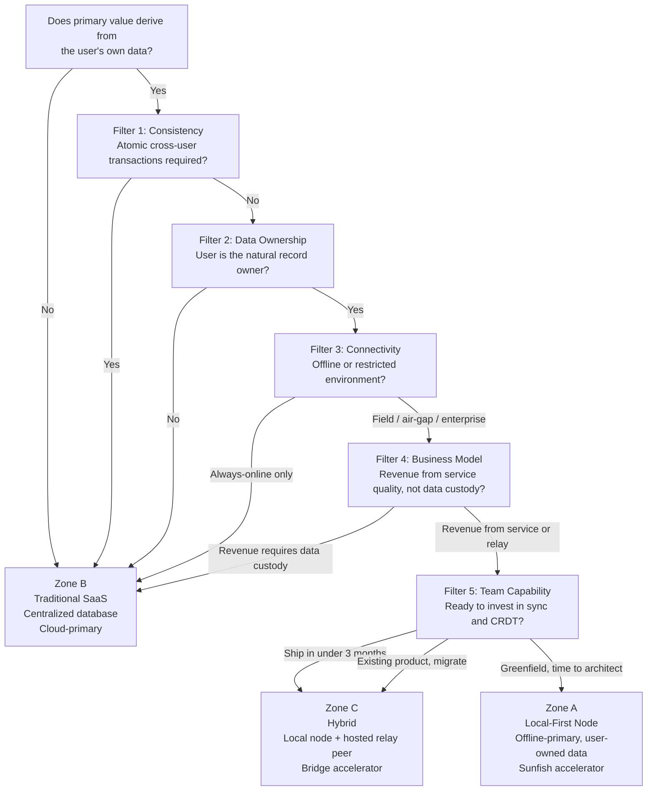

# Chapter 4 - Choosing Your Architecture

<!-- icm/voice-check -->

<!-- Target: ~3,500 words -->
<!-- Source: v13 §20.2–20.8 -->

---

The question this chapter answers is which architectural configuration best satisfies the criteria the preceding chapters establish.

> **Whether the primary value of a software system derives from the user's own data - or from aggregating data across many users - is the first criterion.**

When the value lives in a single user's records - their projects, their clients, their documents, their field data - the local-node architecture is the right default. When the value lives in pooled behavior across users - rankings, recommendations, market pricing, social graphs - centralized infrastructure is structurally required. No version of this architecture changes that answer.

---

## The One Question That Decides Everything

Some software's core value pre-exists every other user. A project management tool where a solo user's project list is valuable on day one. A CRM where a consultant's client records matter before any colleague joins. The user-owned data is the primary asset. The local node is the correct home for that asset.

Other software earns its value only when many users show up. A global leaderboard. A price-discovery marketplace. A social platform where content is worthless without an audience. The primary asset is aggregated state. That asset needs a coordinator. No local-node design changes that.

Most real products contain both. The architecture question is not which category fits the whole product. It is which category fits the *primary* records. Secondary aggregated features sit on a separate service layer without compromising the architecture for the main data plane.

---

The five filters apply in order. Three of them (F1, F2, F4) produce hard-stop verdicts. The order reflects how decisively each filter rules: F1 is a property of the domain, F2 is a property of who owns the data, F3 is a property of the operational environment, F4 is a property of the business model, F5 is a property of the team's capacity. An F1 stop forecloses F2 through F5. If F1 and F2 pass but F4 produces a hard stop, the architecture cannot be reconciled with the business.

## Filter 1: Consistency Requirements (Hard Stop)

This is the strongest filter for disqualifying the architecture. The relevant questions:

| Question | If yes |
|---|---|
| Does any transaction need to be atomic across multiple users *simultaneously*? | **Stop. Centralized only.** |
| Is stale data dangerous - payments, inventory reservations, seat allocations? | **Stop. Centralized only.** |
| Does every user need the exact same truth at the exact same millisecond? | **Stop. Centralized only.** |
| Can users tolerate eventual consistency, where peers may diverge for minutes or hours? | Local-first viable. Continue. |

When a domain requires atomic cross-user transactions - a seat reservation that prevents two users from booking the same seat, a payment that must debit one ledger and credit another atomically, a trade execution that requires globally consistent state at settlement - the local-node architecture is not the right choice for that work.

This does not mean local-node architectures cannot handle financial data. The double-entry ledger here handles CP-class operations correctly: local posting with idempotent replay, CQRS read models for aggregated views, period closing with rollup snapshots. When a product's *core loop* requires cross-user settlements or real-time inventory, it is a payments processor. It is not a local-first productivity tool.

The test is specific. A field operations manager's daily work log shows yesterday's site activity from a peer who came back online this morning - that is eventual consistency, and it is fine. A commodities exchange must show every participant the same order book at the same microsecond. That is a different system.

---

## Filter 2: Data Ownership Profile

Who is the natural owner of the primary records?

| Profile | Model |
|---|---|
| User creates data; data describes the user's own work or clients | Local-first |
| Vendor aggregates anonymous user behavior as the product itself | Centralized |
| User owns their data but wants optional sharing and sync with peers | Local-first + relay |
| Data has value only when pooled: market prices, rankings, recommendations | Centralized |

The distinction is not who *stores* the data. It is who *creates* it, who *uses* it, and who loses something meaningful if it becomes inaccessible. A construction PM's project files belong to the PM and their firm. No other firm's data makes them more or less useful. The natural owner is obvious.

Contrast that with a platform whose core product is behavioral aggregation - an analytics suite that sells insights derived from usage patterns, or a recommendation engine whose value comes from what millions of users clicked last week. The data's value is pooled. The aggregate is the product. That architecture requires a central store.

The most common real-world case is mixed ownership. It resolves to Zone C: user-owned records for the day-to-day data plane, with specific aggregated surfaces - org-wide dashboards, cross-team reporting, benchmarking - handled by a separate service.

When a regulatory custodian must hold the authoritative copy, the architecture cannot make that guarantee structurally. HIPAA accommodates local-first when a Business Associate Agreement covers the storage architecture and audit trails satisfy 45 CFR §164.312's technical safeguards. FINRA Rule 4511 and SEC Rule 17a-4 specify third-party WORM storage for broker-dealer records - requirements that may route specific retention flows to a centralized custodian even when day-to-day operations run local-first. The applicable regime determines what this filter produces.

---

## Filter 3: Connectivity and Operational Environment

The question is not what happens on the happy path. It is what happens when the network is gone for hours or days.

| Environment | Model |
|---|---|
| Field workers, construction sites, rural offices, mobile-poor coverage | Local-first mandatory |
| Air-gapped facilities: defense, nuclear, certain financial data centers | Local-first mandatory |
| Enterprise with MDM governance, IT-controlled endpoints, BYOC storage policy | Local-first node strongly preferred |
| Regulated data residency requirements (GDPR, HIPAA, and equivalents) | Local-first or on-premises |
| Hospital floors, clinical environments, legal depositions | Local-first strongly preferred |
| Always-online, browser-only, zero install friction, anonymous access acceptable | Traditional SaaS |

The actual deployment environment - not the cloud provider's SLA - determines which row applies.

A structural engineer doing site inspections drives between locations with intermittent cell coverage. A legal team in a hotel conference room during depositions cannot guarantee stable internet. A nurse on a hospital floor cannot stop charting because a cloud API returned a timeout. A field crew at a rural extraction site may have satellite uptime measured in hours per day.

Globally, intermittent connectivity is the baseline, not the exception. Hundreds of millions of enterprise workers across Sub-Saharan Africa, South and Southeast Asia, and rural Latin America operate through load-shedding and coverage gaps as daily conditions. For these markets, local-first is not a contingency design. It is the architecture that matches the work.

The enterprise environment deserves separate attention. IT departments in regulated industries - finance, healthcare, defense contracting, government - require that data not leave controlled infrastructure. A local-node architecture where data lives on MDM-managed endpoints under IT's control passes that requirement by design. The data residency properties this architecture provides are a primary procurement advantage in enterprise sales, not a secondary nice-to-have.

The regulatory landscape behind this filter is global and expanding. European pressure comes from the 2020 Schrems II ruling, followed by the 2023 EU-US Data Privacy Framework - itself in active legal review. India's DPDP Act 2023 and the RBI data localization circular, the UAE's DIFC DPL 2020, and Russia's Federal Law 242-FZ represent the leading edge. In each jurisdiction, data on the user's own hardware is the architecture that makes compliance tractable. In several, it is closer to what the law requires. The full coverage matrix is in Appendix F.

---

## Filter 4: Business Model Alignment

Whether the business model depends on controlling data access - or thrives when users control their own data - is the defining question for this filter.

| Situation | Implication |
|---|---|
| Revenue from monthly access to a hosted service where data lives server-side | Traditional SaaS viable - exposed to switching-cost erosion over time |
| Revenue from support, professional services, managed relay, or tooling extensions | Local-first strongly viable |
| Network effects require all users on a single shared platform to function | Centralized required |
| Enterprise sales with security review, vendor risk assessment, data residency audit | Local-first node (structurally easier to pass procurement review) |
| Open-source sustainability with a managed hosted offering as the revenue path | Local-first strongly preferred |

This filter catches a mismatch technical teams often miss. A team builds the right local-node architecture for its domain. Then it adopts a business model that requires controlling data access. It has built an internal contradiction.

When revenue requires that users *cannot* access their data without the vendor's platform - per-API-call billing, subscription gating that prevents export, data lock-in as the primary retention mechanism - the local-node architecture undermines the business. Users who own their data can leave.

When revenue comes from service quality, support, the convenience of a managed relay, or enterprise support contracts, the local-node architecture is additive. Users who own their data and can export it freely still pay for a well-run relay, responsive support, and a team that handles infrastructure complexity they do not want to manage.

Dual-licensing - an open-source core with a commercial managed offering - is the strongest alignment pattern for this architecture. Revenue scales with the quality of the service, not with the difficulty of leaving.

---

## Filter 5: Team Capability and Timeline

This filter governs *when* and *how*. It does not govern *whether*. A team fully committed to Zone A that ships nothing in the first year serves no user.

| Constraint | Implication |
|---|---|
| Need to ship in under 3 months | Start with traditional SaaS; architect for local-node migration from day one |
| Team has no CRDT or distributed sync experience | Budget 3–6 months for CRDT and sync; add 1–3 months for key management design before production |
| Existing hosted product with established user base and historical data | Hybrid: retain cloud as sync relay, add local-node capability incrementally |
| Greenfield project with a team prepared to invest in the architecture | Local-first node from day one |

Four skills separate local-node development from standard web application development.

**CRDT debugging.** When two peers diverge and produce unexpected merged state, the developer must understand which CRDT types were involved, which operations arrived in which order, and what the merge semantics guarantee. The mental model is different from debugging a request-response API.

**Distributed state management.** The local node holds authoritative state that must remain consistent under concurrent local edits, incoming sync deltas, and schema migrations simultaneously. Managing that state correctly requires explicit design, not improvisation.

**Schema migration in a multi-version environment.** Nodes update independently. A schema migration must work correctly when a newly updated node exchanges data with a node running two versions behind. The expand-contract pattern - adding new fields before removing old ones, maintaining backward-compatible event formats during a transition window - is not optional.

**Key management.** The architecture requires per-document data encryption keys, per-role key encryption keys, and device identity keys. Rotation, revocation, and recovery procedures must be designed before the first production deployment. One to three months for key hierarchy design and rotation procedure implementation before naming a production date is the realistic budget.

These skills are learnable. The combined estimate - three to six months for CRDT and sync plus one to three months for key management - reflects real project history, not pessimism. Teams that treat those months as a legitimate investment ship stable systems. Teams that skip them ship systems that fail on reconnection edge cases and schema incompatibilities in the field.

Engineering capability is necessary but not sufficient. Operational capability is the second half of F5: fleet telemetry exported from unowned endpoints, MDM coordination with customer IT on installer signing, supply-chain signing with notarization and a published SBOM, and on-call runbooks for common fleet failure modes. Each is a real engineering commitment. Part IV (Chapters 17–20) and Chapter 21 specify the playbooks.

---

## The Three Outcome Zones

Running the five filters produces one of three conclusions.

**Zone A - Local-First Node**

All five filters clear without a hard stop. Every user runs a complete local node. The relay is optional infrastructure for peer discovery and backup. The software operates at full fidelity without any server.

Zone A applies to: single-tenant or team-scoped productivity and business software; offline or regulated operational environments; software whose core value exists before any other user joins; professional or enterprise users who install software and expect it to stay installed. Representative domains: project management, professional CRM, field operations tools, legal and healthcare records management, engineering and design applications.

The Zone A operational picture: a fleet of MDM-managed endpoints running the Zone A accelerator (Harborline Shipyard `accelerators/anchor/`), a self-hosted or managed relay coordinating peer discovery, and a fleet observability pipeline collecting per-endpoint sync-health, schema-version, and key-rotation telemetry. When the relay fails, day-to-day work continues; sync catches up when the relay returns. Part III (Chapters 11–16) specifies the architecture; Part IV (Chapters 17–20) and Chapter 21 specify the playbooks.

**Zone B - Traditional SaaS or Website**

Filter 1, Filter 2, or Filter 4 produced a hard "Centralized only" verdict. Zone B is correct for: multi-tenant aggregation as the core value proposition; anonymous public access without persistent identity; millisecond global consistency as a domain requirement; and fast-ship greenfield projects where this architecture would be overkill. A two-person team prototyping a public-facing web app over a weekend should not carry CRDT debugging overhead. Zone B is the right answer there too.

**Zone C - Hybrid**

The filters pass for user-scoped primary records but fail for specific coordination features - or Filter 5 indicates a timeline that cannot support the full Zone A investment immediately. The local node handles all user-owned data and day-to-day compute. The cloud relay handles sync, cross-organization collaboration, payments, and compliance reporting. A traditional web layer handles public-facing surfaces. The Zone C accelerator (Harborline `accelerators/bridge/`) is the reference implementation; Chapter 18 specifies the Zone C migration playbook.

Zone C also applies to teams migrating an existing SaaS product. Retaining cloud infrastructure as the sync relay while adding local-node capability incrementally is a legitimate migration path. Hybrids that allow server-side logic to accumulate indefinitely tend to re-centralize gradually - a failure mode the epilogue addresses directly.

Under GDPR Article 28, a managed-relay operator that routes encrypted traffic without holding decryption keys acts as a processor rather than a controller. Chapter 15 specifies the data-processing-agreement template and the relay-operator legal posture.

### Per-Zone Compliance Posture

Each Zone enables a different default compliance posture. The framework below names the structural baseline; Chapter 15 specifies the supplemental controls and Appendix F details the per-jurisdiction obligations.

| Regulatory regime | Zone A (Local-First Node) | Zone C (Hybrid) | Zone B (Traditional SaaS) |
|---|---|---|---|
| **GDPR / Schrems II** | Data residency satisfied structurally; relay holds ciphertext only | Same as Zone A on the data-plane; relay-operator-as-processor agreement under Article 28 required | Requires Standard Contractual Clauses + supplemental safeguards per Schrems II |
| **HIPAA** | §164.312 technical safeguards met by encryption-at-rest + role-scoped keys; §164.308 administrative safeguards depend on the operator's policies | Same as Zone A on the local-data plane; BAA covers the relay operator | BAA with vendor required; administrative safeguards covered by vendor's compliance program |
| **DIFC DPL / GCC residency laws** | Authoritative data on user-controlled hardware in-jurisdiction; satisfied by default | Same as Zone A if relay is in-jurisdiction; otherwise transfer requirements apply | Requires in-jurisdiction cloud region + cross-border transfer governance |
| **India DPDP / RBI circular** | User-controlled storage in-jurisdiction satisfies localization | Relay placement determines transfer posture | Requires in-jurisdiction infrastructure |
| **China PIPL** | User-controlled storage in-jurisdiction satisfies most data-localization rules; security assessment still required for cross-border transfers | Same as Zone A if relay is in-jurisdiction; cross-border transfer requires CAC security assessment | Requires CAC-approved cross-border transfer mechanism |
| **Brazil LGPD** | User-controlled storage satisfies data-subject rights structurally | Relay placement determines transfer posture; requires DPA with relay operator | Requires LGPD-compliant transfer mechanism |
| **Japan APPI / Korea PIPA** | User-controlled storage in-jurisdiction simplifies cross-border-transfer analysis | Relay placement governs transfer posture; opt-in consent for cross-border transfer typically required | Requires explicit consent or equivalent mechanism for cross-border transfer |
| **South Africa POPIA / Nigeria NDPR** | In-jurisdiction user-controlled storage satisfies the residency-leaning provisions | Same as Zone A if relay is in-jurisdiction; otherwise transfer-restriction analysis applies | Requires in-jurisdiction infrastructure or compliant cross-border transfer mechanism |
| **Russia 242-FZ** | Personal-data storage on Russian-territory user-controlled hardware satisfies the requirement structurally | Relay must be in-territory; or storage component must remain in-jurisdiction with transfer restrictions | Requires in-territory cloud infrastructure for any personal-data-handling subsystem |
| **SOC 2** | Vendor's own SOC 2 covers software-supply-chain controls; customer's IT covers endpoint operation | Vendor's SOC 2 covers software + relay; customer's IT covers endpoints | Vendor's SOC 2 covers everything end-to-end |

Local-first does not skip compliance; it shifts where compliance burden sits. Zone A moves operational compliance toward the customer's IT - which is what regulated customers want, because they already have the controls. Zone B keeps compliance with the vendor. Zone C splits the burden along the same line as the data plane.

### A Worked Example: The Construction-Industry SaaS Migration

A 60-person construction-industry software company has shipped a hosted SaaS for project bid management since 2019. Their largest customers are general contractors in Texas, Saudi Arabia, and Germany. The Saudi customer's IT team has flagged data residency as a procurement blocker; the German customer's data protection officer has raised Schrems II concerns; the Texas customer is rebidding the contract. The team evaluates whether to migrate to Zone A, Zone C, or stay in Zone B.

*Filter 1 (Consistency).* Project bids, takeoff sheets, RFI logs, and submittal histories are not atomic cross-user transactions. A two-hour eventual-consistency window is acceptable. The double-entry change-order ledger can be modeled as a per-project Flease-coordinated lease scoped to one project, specified in Chapter 14. **Pass.**

*Filter 2 (Data ownership).* Each general contractor's project data describes their own work, their own subcontractors, and their own contractual obligations. No regulatory custodian holds the authoritative copy. **User is the natural owner. Local-first.**

*Filter 3 (Connectivity).* Field superintendents work on construction sites with intermittent cellular coverage. Owner conferences happen in client offices behind enterprise firewalls. **Local-first mandatory.**

*Filter 4 (Business model).* Revenue comes from per-seat subscription: bid templates, QuickBooks and Procore integration, tier-2 support. Users retain historical bids when subscriptions lapse. **Local-first viable.**

*Filter 5 (Team capability).* The team has built sync engines before but not CRDT-based ones. Existing customers cannot tolerate a six-month feature freeze. **Zone C - Hybrid migration, retain cloud relay, add local-node capability incrementally.**

Verdict: Zone C. The team adopts the Zone C accelerator pattern, runs Phase 1 (data-plane local replicas with read-through to the existing API) for 90 days, then Phase 2 (write-path migration to local-first with the existing API as a sync relay) over the following six months. Chapter 18 specifies this migration playbook in detail.

---

## What the Analysis Produces

Three questions produce a fast first-pass answer for most cases.

**Whether users own their primary records.** The records describe the user's work, their clients, their projects. The user retains access even after they stop paying. An affirmative points toward local-node as the right default.

**Whether the system must work offline for extended periods.** Not whether offline operation would be convenient - whether users are in environments where reliable connectivity cannot be guaranteed. An affirmative means the architecture must treat offline as the primary case, not a fallback.

**Whether the product must outlive vendor infrastructure.** The software should keep working regardless of whether the vendor survives, is acquired, changes pricing, or is directed to stop serving a given jurisdiction - as hundreds of thousands of organizations in Russia and CIS markets learned in 2022 when Western SaaS vendors suspended service under sanctions enforcement. An affirmative means the product must hold its own authoritative data.

When all three answers are affirmative: Zone A or Zone C applies. A greenfield project starts with the Zone A accelerator (the Anchor pattern - offline-by-default local-first desktop). A migration or hybrid deployment starts with the Zone C accelerator (the comms mesh pattern - hybrid SaaS with relay). The full five filters confirm no blocking constraint applies.

When any answer is negative: the corresponding filter captures the implication. A negative on the first question is Filter 2. A negative on the second is a Zone C tolerance. A negative on the third is Filter 4. Each has a specific implication, and the relevant filter section above addresses it.

---

A system that clears all five filters earns an architecture that outlives vendor decisions, works through connectivity gaps and power interruptions, and satisfies compliance in every major regulatory jurisdiction. The Zone A accelerator is the reference implementation for greenfield local-first projects. The Zone C accelerator is the reference for teams migrating an existing SaaS product. Both reference Sunfish (the open-source ERP product, [github.com/ctwoodwa/Sunfish](https://github.com/ctwoodwa/Sunfish)) packages - pre-1.0 implementations of the architecture this book specifies, not finished products - and both are specified in full in Part IV.

Before that implementation, Part II stress-tests the architecture against the hardest objections five domain experts could construct. The council did not begin as believers. Every block they raised and every objection they cleared makes the architecture stronger and the failure modes better understood.
