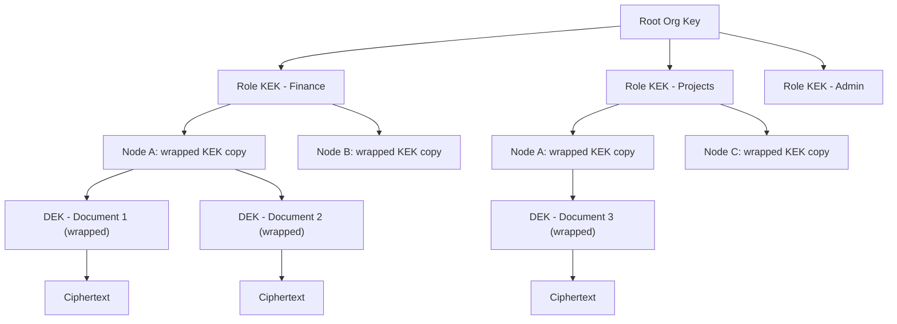

# Chapter 7 - The Security Lens

<!-- icm/voice-check -->

<!-- Target: ~3,500 words -->
<!-- Source: R1 Okonkwo, R2 Okonkwo, v13 §11, v5 §4 -->

---

Nia Okonkwo holds the security seat on Joel's dissertation committee. Her charter is not to evaluate elegance — it is to find the gap between the key hierarchy on paper and the incident response on the morning a key actually gets stolen.

She has broken three "local-first" demos in under twenty minutes. The pattern was the same each time: ignore the application layer, ignore the data-at-rest story, go straight for the sync channel. Two demos had no auth on the sync socket at all. The third had auth — a sixteen-character string hardcoded in the config, found by running `strings` on the binary.

Okonkwo is hostile because distributed architectures fail at exactly the places their designers felt most confident. The encryption is usually fine. The key hierarchy is often documented. What breaks is the incident response on the morning a key actually gets stolen.

She read the first version of Joel's dissertation with that question in front of her — not *is the cryptography correct*, but *what happens the day after the breach.*

---

## Act 1: Round 1 — The Key Compromise Gap

### What Earned a 9/10

The first version gets data minimization at the protocol layer nearly right. Subscription filtering is enforced at the sync daemon's send tier — not at the application layer, not at the UI — and that placement is specified clearly. A node that lacks the required role attestation never receives the operations. There is no receive-and-hide. There is no application layer trusted to discard what it should not have. The daemon does not send it.

Okonkwo scored this a 9 out of 10. In her experience, teams build an application that receives all data and enforces visibility rules in UI components — which means the data already crossed the network, already landed in local storage, already accessible to anyone who knows where to look. Send-tier filtering is the achievement that makes the rest of the security story coherent.

The threat model section earns her respect for a related reason. The paper acknowledges that distributing data to endpoints distributes the honeypot problem to the weakest endpoint. A cloud database is one high-value target. A fleet of workstations is a larger attack surface with heterogeneous posture. The paper does not pretend otherwise — but it does not follow that acknowledgment to its conclusion.

### The Blocking Issue: No Key Compromise Response

The key hierarchy uses envelope encryption. Each document gets a random Data Encryption Key (DEK). Each role gets a Key Encryption Key (KEK). The DEK is encrypted with the role KEK and stored alongside the ciphertext. When role membership changes, the administrator generates a new KEK, re-wraps all DEKs, and discards the old KEK.

This is the correct model. The trouble is what happens when the KEK is compromised — not rotated on schedule, but stolen.

The first version scores a 5 out of 10 on incident response for key compromise. No detection mechanism. No re-keying procedure for the compromise case. No analysis of the historical data exposure window. No user notification path.

Consider the failure scenario. A senior administrator's workstation is stolen on the train home. The attacker breaks full-disk encryption — realistic if the device is powered on — and extracts the OS keychain. The keychain holds the current role KEK for every role this administrator manages. With the KEK, the attacker decrypts every wrapped DEK in the sync log. Every document those roles ever accessed is now readable. The paper describes the key hierarchy and stops there.

For Okonkwo, this is not a documentation gap. An architecture that specifies a key hierarchy without specifying what to do when the hierarchy is violated has not specified a security model. It has specified a pleasant normal-path story.

Four questions sit unanswered. *How does the system detect a key compromise?* Detection time defines the data-at-risk scope — the attacker operates with the key until detection. *What is the re-keying procedure for the compromise case?* Scheduled rotation uses the existing KEK to re-wrap DEKs; a compromised KEK cannot be used to re-wrap, because doing so produces DEKs wrapped with the same compromised key. The procedure must generate an entirely new KEK chain.

The third question is the one that wakes Okonkwo at 3 a.m. *What historical data is at risk?* A compromised KEK exposes every document it ever protected, back to the moment the key was created. The data-at-risk window is defined by the KEK's age, not by when the compromise occurred.

The fourth question is the one most architectures forget. *What does the user see?* An incident response that produces correct cryptographic behavior without user-visible notification is not an incident response.

### Round 1 Verdict: PROCEED WITH CONDITIONS

Okonkwo issues PROCEED WITH CONDITIONS. The domain average of 7.3 supports that verdict — but one condition is a prerequisite, not a condition in the ordinary sense. A security review cannot clear a key-based system without a specified compromise response. The architecture is unusually honest: the threat model is real, the send-tier filtering is correct, the attacker-mindset framing is rare in local-first literature. The incident response gap is exactly the kind of gap that fails real-world security reviews. The condition holds until resolved.

---

## What Changed Between Rounds

The revision resolved the blocking issue. It specified the compromise response in full and diagrammed the key hierarchy from the root organization key through role KEKs, per-node wrapped copies, per-record DEKs, and ciphertext. No level is implicit.

The revision specifies the key compromise response procedure. Detection triggers include physical loss reports, anomalous access patterns in the audit log, and explicit administrator reports. On detection: generate an entirely new KEK for the affected role, not derived from the compromised key; re-wrap every DEK owned by that role using the new KEK; discard the old KEK and all node-level copies; broadcast revocation through the relay; notify affected users with the data-at-risk window — from the compromised key's creation date to the moment of revocation.

The offline node revocation reconnection flow is now specified at the step level. When an offline node reconnects, the sync daemon presents its attestation bundle to the relay. The relay checks the revocation log. If any key in the bundle has been revoked, the relay rejects the sync handshake with a specific error code indicating revocation — not a generic connection failure. Before sync can resume, the node must obtain a fresh key bundle, which requires re-authentication against the IdP, new role attestations, and new wrapped KEK copies from the administrator. The user sees: "Your access credentials have been updated. Sign in again to continue syncing."

In-memory key material is addressed as implementation constraints on `Harborline.Kernel.Security`: locked memory pages prevent the OS from swapping key material to disk; the application zeros key material on process exit.

---

## Act 2: Round 2 — Four Remaining Conditions

Round 2 opens with a commendation. The data minimization at the sync layer is architecturally correct and, in Okonkwo's assessment, represents a meaningful improvement over most commercial CRDT implementations. Four conditions remain. None is a block.

### Supply Chain: Who Signs the Release

The architecture uses content-addressed identifiers for update distribution. Clients verify the content identifier (CID) before installation. A compromised CDN cannot serve a corrupt package because the CID mismatch fails immediately.

The gap is one step earlier. The CID guarantees the integrity of the package relative to the CID. It does not guarantee that the CID itself came from the legitimate build process. An attacker who compromises the build system produces a valid package, computes its correct CID, and signs that CID with a compromised release signing key. Clients verify the CID, confirm it matches, and install the attacker's payload — exactly as the protocol specifies.

Three gaps remain. First, the release signing key needs a custody specification: who holds it, how it is stored, what happens if it is compromised. A release signing key on a developer's laptop is a single point of failure with a coffee shop's WiFi attached. Second, reproducible builds: independent parties must verify that the published binary matches the published source. Third, integration with a supply chain transparency framework such as Sigstore [1], which provides a publicly auditable log of signing events. A signing event that does not appear in the transparency log can be detected and rejected by clients.

Okonkwo scores this dimension 7 out of 10.

### The Compromised Relay

The relay is untrusted transport. All data is end-to-end encrypted. The relay handles ciphertext. A relay operator who reads everything on the wire gets operation identifiers and timestamps, not payloads.

This is the right architecture. The condition is about what the relay can see even when it cannot read payloads. A relay operator who cannot read messages can still observe which nodes communicate with which, at what times, and at what volume. For a legal firm, the communication pattern between two nodes during a specific time window can reveal which matters are active and which team members are collaborating — without any payload access. For healthcare deployments, communication frequency between specific nodes can reveal patient activity patterns.

The limitation is real and must be disclosed. Organizations for whom metadata privacy is a hard requirement should run a self-hosted relay on infrastructure they control.

**Compelled Access as a Distinct Threat Model.** The compromised-relay threat model has a cousin that deserves its own name: compelled access. In jurisdictions where cloud-hosted infrastructure is subject to mandatory government access requirements, end-to-end encryption with keys that never leave the originating device answers a threat model that cloud storage cannot satisfy architecturally. The relay operator cannot produce decryptable content under a compulsion order because the relay operator does not hold decryptable content. This is not a cryptographic subtlety — it is the structural reason the architecture answers compelled-access regimes that customer-managed-key approaches cannot reach.

The 2022 sanctions enforcement event is the canonical empirical anchor. Adobe, Autodesk, Microsoft, Figma, and dozens of other Western SaaS vendors suspended service across Russia and CIS markets on days of notice. Hundreds of thousands of organizations lost access. The failure mode was not technical — it was jurisdictional. CIS-region import substitution requirements followed directly, and the local-key, ciphertext-relay posture is the structural answer those requirements describe. The closest SaaS analog — customer-managed keys with Microsoft 365 or Salesforce Shield — narrows the legal surface but does not move the trust boundary off vendor-controlled infrastructure. The inverted stack moves the trust boundary onto the customer's endpoint.

### Physical Access and the Memory Window

The at-rest encryption story is correct. SQLCipher protects local databases. Keys are derived from user credentials using Argon2id and stored in OS-native keystores. Physical storage extraction without credentials produces no plaintext.

The gap is the memory window while the application is running. An attacker with thirty minutes of physical access to a live system can use cold boot techniques — DRAM contents persist briefly after power loss and can be read if the attacker acts within seconds to minutes of shutdown — or memory forensics tools that run from a bootable USB to dump process memory directly. The decryption key in memory is readable by both techniques.

The mitigation is a re-authentication interval: the application requests re-authentication from the OS keychain at configurable intervals. Four hours is the recommended default for high-security deployments. This is a hardening recommendation, not an architecture flaw. Okonkwo scores physical access an 8 out of 10.

### Credential Recovery and Account Continuity

The paper specifies three recovery paths. For passphrase loss: an optional recovery-key file generated at account setup unseals the local keystore without the passphrase; organizations requiring centralized recovery can enable administrator-held wrapped KEK copies under a defined escrow procedure. For OS keystore corruption: re-enrollment via the organization's MDM re-delivers the role attestation to a fresh keystore, and relay-assisted re-sync restores the node's data from peers. For legal hold on a departed employee's device: the encrypted SQLCipher database is extractable by IT with the administrator's escrow KEK.

What the architecture does not support: instant recovery without a recovery artifact. A user who lost their passphrase, declined recovery-key backup, declined organizational escrow, and whose device is the only copy of local-only records has lost them. Organizations must choose at least one recovery path and test it before production.

Okonkwo scores credential recovery 7 out of 10.

### GDPR Article 17 in a CRDT System

This is the condition Okonkwo scores lowest in Round 2: compliance framework mapping, 5 out of 10. Article 17 of the GDPR [2] requires deletion of personal data on request; the no-GC compliance tier's operation log is immutable by design, and the immutability is the feature — append-only signed entries are what regulated industries require for tamper-evident audit. The architecture cannot simultaneously provide an immutable audit log and comply with Article 17 through conventional deletion.

The resolution is crypto-shredding: destroy the DEK that protects the operation's content rather than remove the operation itself. The operation entry remains in the log, preserving DAG integrity; its ciphertext becomes an unrecoverable stub. Chapter 15 specifies the mechanism, including the procedural exemption under GDPR Article 17(3)(b) for processing necessary for legal obligations.

The pattern's known limitation is metadata residue. Operation identifiers, timestamps, and structural position in the DAG remain after DEK destruction. Whether that metadata constitutes personal data under Article 17 is jurisdictional — a legal question, not an architectural one. Disclose it. The same crypto-shredding pattern applies to the parallel right-to-erasure regimes in GDPR, India's DPDP Act, Brazil's LGPD, and the regimes named in Appendix F.

### Round 2 Verdict: PROCEED WITH CONDITIONS

Okonkwo issues PROCEED WITH CONDITIONS. Domain average 7.0. The blocking issue from Round 1 is fully resolved. The full condition list:

**C1 (High):** Specify release signing key custody, reproducible build requirement, and Sigstore integration for update supply chain transparency.

**C2 (High):** Address GDPR Article 17 for the no-GC compliance CRDT tier — document the crypto-shredding pattern and explicitly scope the limitation on operation metadata.

**C3 (Medium):** Acknowledge relay metadata and traffic analysis limitation for high-sensitivity deployments. State the self-hosted relay as the mitigation.

**C4 (Medium):** Specify a recommended default re-attestation interval — twenty-four hours balances a bounded revocation window against operational friction.

**C5 (Low):** Add cold boot and in-memory key hardening recommendation for high-security deployments, including the four-hour re-authentication interval guidance.

**C6 (Medium):** Document the three supported credential recovery paths and explicitly name the unsupported no-artifact case.

C1 and C2 must be addressed before first external release. C3 through C6 are addressable in the companion document without blocking alpha implementation. The architecture cleared a security review that began with three demos broken in twenty minutes. The conditions govern the operational hardening — supply chain custody, metadata disclosures, recovery paths, re-attestation cadence — that turns a sound key hierarchy into a deployable security posture.

---

## The Principle: Defense-in-Depth Is Not Optional

The security review surfaces the central tension in distributed endpoint architectures. The inverted stack solves the central honeypot problem: a compromised node exposes only what that node is authorized to access. A fleet of workstations is a harder target than a single cloud database.

This is a genuine improvement — and a displacement of the problem, not an elimination of it. A fleet is a distributed attack surface. The security posture of the weakest endpoint is the security posture of the data that endpoint holds. In an enterprise deployment with fifty nodes, an attacker targets the administrator with the broadest role access and the worst patch cadence.

The architecture requires defense-in-depth across four layers. Each is built from independently audited cryptographic primitives — libsodium, age, Argon2id reference, SQLCipher — composed against a written specification a cryptographic engineer has reviewed.

Layer one: encryption at rest. SQLCipher, Argon2id key derivation, OS-native keystores. Physical storage extraction without credentials yields no plaintext. Table stakes.

Layer two: field-level encryption. Per-record DEKs, per-role KEKs, DEK/KEK envelope encryption. An attacker who compromises a node's local storage gets encrypted blobs. Without the KEK, the DEKs are useless. Without the DEKs, the ciphertext is useless.

Layer three: stream-level data minimization. Subscription filtering at the sync daemon's send tier. A compromised node is limited to the operations it was authorized to receive. The blast radius of a single node compromise is bounded by role scope, enforced at the protocol layer where application changes cannot bypass it.

Layer four: circuit breaker and quarantine. When a node reconnects after a long offline period, its queued writes enter a quarantine queue and are validated against current policy before merging. A compromised offline node cannot push malicious writes on reconnection.

The send-tier filtering invariant is what makes the security story credible. Without it, layers one and two protect data at rest but cannot contain a breach once data is in transit. An application-layer filter that receives all operations and hides some in the UI is a UI control, not a security control. An attacker with access to the sync socket or the local database bypasses it entirely.

Every practitioner building on this architecture must treat the send-tier filtering invariant as inviolable. The filter belongs in the sync daemon. It does not belong in the view layer, the API handler, or a permission check on a UI component. The moment it moves, the blast radius of any node compromise expands from role-scoped to total.

Distribute the data to endpoints for resilience. Treat each endpoint as a potential breach. Four layers. No shortcuts.

---

## The Non-Negotiable Security Checklist

What a practitioner carries forward from Okonkwo's review:

- **DEK/KEK envelope encryption is enforced at the architecture level, not the application level.** The key hierarchy is audited, not invented; primitives are libsodium, age, Argon2id reference, SQLCipher; compositions require a cryptographic engineer's sign-off against a written specification.
- **Send-tier filtering is an inviolable protocol invariant.** Subscription filtering lives in the sync daemon, not in the UI, not in an API handler, not in a permission check on a view component. If it moves, blast radius expands from role-scoped to total.
- **Key compromise response is specified and tested before first production deployment.** Revocation procedure, administrator re-attestation flow with a twenty-four-hour recommended interval, offline-node reconnection handling, and capability-rotation propagation are documented with timing commitments — not described as design intent.
- **Root organization key custody uses HSM or multi-party ceremony.** A compromised root key is a higher-order failure than a compromised role KEK. Deployments under import substitution constraints or in jurisdictions where Western HSM hardware is not approved must use a domestic HSM equivalent or a documented multi-party key ceremony.
- **Supply-chain transparency is signed, reproducible, and attestable.** Release signing key custody is documented; reproducible builds are required for release artifacts; Sigstore or equivalent attestations ship with every release; SBOM accompanies the binary.
- **Relay is ciphertext-only with a self-hosted path for metadata-sensitive deployments.** Compelled-access and traffic-analysis threat models are named explicitly; self-hosted relay operation is a supported configuration, not a fork.
- **Credential recovery offers at least one artifact-based path.** Recovery-key file, administrator-held wrapped KEK escrow, or MDM re-enrollment plus relay-assisted re-sync — organizations must choose and test one before production. The no-artifact case is disclosed to users at onboarding.
- **Right-to-erasure is implemented via crypto-shredding with documented metadata residue.** DEK destruction makes operation content unrecoverable; operation metadata remains and must be disclosed to the data protection officer; the pattern applies uniformly to GDPR, India's DPDP, and Brazil's LGPD obligations.

---

## References

[1] S. E. Bhatt et al., "Sigstore: Software Signing for Everybody," in *Proc. 29th ACM Conf. Comput. Commun. Secur. (CCS '22)*, Los Angeles, CA, USA, Nov. 2022, pp. 2353–2367, doi: 10.1145/3548606.3560596.

[2] European Parliament and Council, "General Data Protection Regulation (GDPR)," Regulation (EU) 2016/679, Art. 17 - Right to Erasure, *Off. J. Eur. Union*, Apr. 2016.
