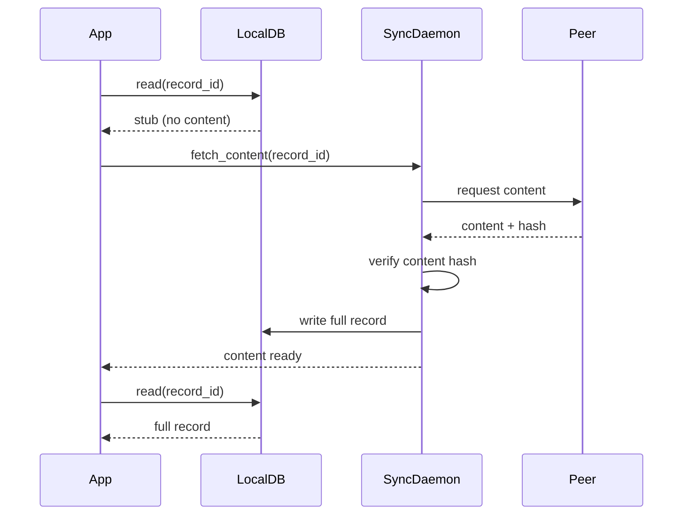
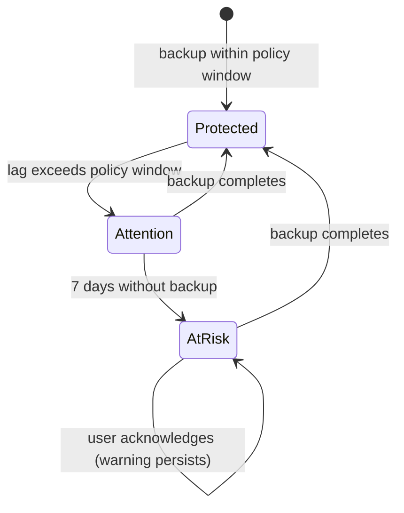
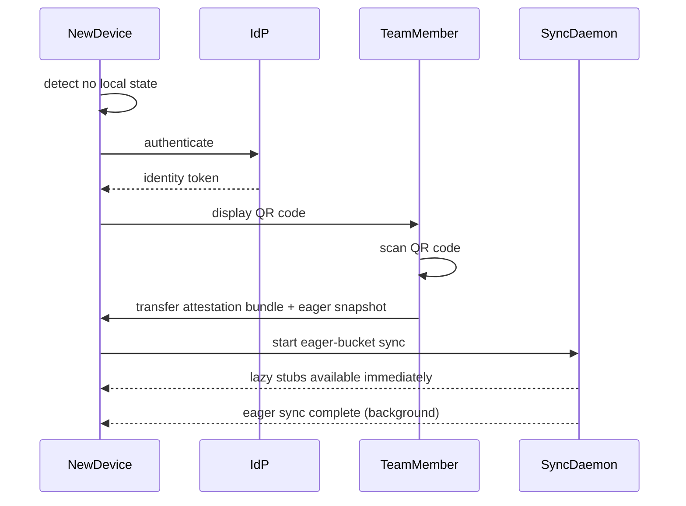

# Chapter 16 - Persistence Beyond the Node

<!-- icm/voice-check -->

<!-- Target: ~3,500 words -->
<!-- Source: v13 §2.4, §8, §9, §10, v5 §3.5 -->

---

## The Problem Single-Node Storage Cannot Solve

A node that stores data only on its local device fails in three ways. Drives fail. Phones are lost. Laptops are stolen. Multi-gigabyte local databases suit active working data — not every archive, every team member's history, every binary asset ever uploaded. Users move to new devices and expect their work to follow.

Local-first architecture does not mean data lives on one machine. It means the node is the authority over the data it holds. The architecture must specify how that data survives beyond it.

---

## Five-Layer Storage Architecture

Persistence in the local-first architecture composes five tiers, specified in Chapter 12 §The Five-Layer Storage Architecture. This chapter focuses on what each tier owns operationally — bucket subscription, lazy fetch, snapshot rehydration, backup UX, relay metadata posture, and disaster recovery — assuming the five-tier model from Ch12. Tiers 4 and 5 are opt-in; the core system is fully operational on tiers 1–3 alone.

---

## Declarative Sync Buckets

Full replication to every node fails at scale in two ways. As a storage problem, multi-gigabyte databases overwhelm devices with constrained storage. As a security problem, nodes hold data they are not authorized to use, protected only by application-layer access control — a boundary one application bug wide.

Declarative sync buckets solve both. A bucket is a named, declaratively specified subset of the team dataset. Bucket membership ties to role attestations, not to application-layer decisions made after data arrives at the node. Non-eligible nodes never receive bucket events because the sync daemon excludes them at capability negotiation.

Buckets are declared in YAML:

```yaml
buckets:
  - name: team_core
    record_types: [projects, tasks, members, comments]
    filter: record.team_id = peer.team_id
    replication: eager
    required_attestation: team_member

  - name: financial_records
    record_types: [invoices, payments, budgets]
    filter: record.team_id = peer.team_id
    replication: eager
    required_attestation: financial_role

  - name: archived_projects
    record_types: [projects, tasks]
    filter: project.archived = true
    replication: lazy
    required_attestation: team_member
    max_local_age_days: 90
```

Each bucket specifies:

- **name** — unique identifier used in sync daemon routing and backup manifests.
- **record_types** — the document types included in the bucket.
- **filter** — a predicate evaluated per record against peer attributes. Only records satisfying the filter replicate to a given peer.
- **replication** — `eager` or `lazy`. Eager buckets sync immediately on connect. Lazy buckets use demand-driven fetch.
- **required_attestation** — the role attestation a peer must present to receive bucket events. The sync daemon verifies it cryptographically before any data flows.
- **max_local_age_days** — for lazy buckets, the maximum age of locally cached records before eviction.

Bucket eligibility is evaluated at capability negotiation — the handshake described in Chapter 14. The sync daemon constructs the minimal subscription set from the peer's verified attestations. A peer with only `team_member` receives `team_core` and `archived_projects`. A peer with `financial_role` receives all three. Unauthorized data never reaches a node that is not authorized to hold it.

---

## Lazy Fetch and Storage Budgets

Eager replication serves active working data. Lazy replication serves archives, large binary assets, and records with infrequent access.

A lazy-replicated record is represented locally as a stub containing the record's identifier, metadata required for display and navigation, and a content hash. The stub lets the application render navigation, search indexes, and list views without fetching full content. When the user opens a record, the application detects the stub, fetches full content from a peer or from the backup tier, verifies the content hash, and writes the full record to the local database.

Nodes enforce a configurable local storage budget (default 10 GB). When the node approaches the budget ceiling, the sync daemon evicts least-recently-used records from lazy buckets. Eviction converts a full record back to a stub — the identifier, metadata, and content hash are retained; the content is released. The record is not deleted. It remains accessible on demand.



Content hash verification on re-fetch is mandatory. A fetched record whose hash does not match the stub's stored hash is rejected and re-requested from an alternate peer, protecting against corruption and deliberate tampering. The storage budget, eviction policy, and minimum stub retention period are configurable via `Harborline.Kernel.Buckets`.

---

## Per-Data-Class Device Distribution

<!-- code-check: namespaces referenced - Harborline.Kernel.Buckets (in canon, Ch16:128), Harborline.Kernel.Sync (in canon, Ch14), Harborline.Kernel.Audit (in canon per cerebrum 2026-04-28). APIs illustrative pending v1.0. -->

Device fleets are heterogeneous by design. A restaurant floor tablet holds customer orders and table assignments; the back-office laptop holds payroll and vendor invoices. Uniform replication fails both ways: the floor tablet holds payroll records a server has no operational need for, and a constrained device's storage budget fills with classes it will never display.

The first failure is a security-surface problem. Application access controls prevent unauthorized payroll lookups, but once payroll records sit in the local encrypted database the risk surface shifts to a decryption-key exposure or a future application bug. A record not on a device cannot be leaked from it. The second failure is a storage-budget problem. The bucket model filters by user attestation; per-data-class device distribution adds an orthogonal axis — not what the user is authorized to see, but what classes this device's operational role requires.

### The class-subscription manifest

Each device carries a signed manifest declaring the data classes it accepts. The manifest is device-bound policy, set by the MDM operator or by the user in consumer deployments. It is not a role attestation. A device can hold a `financial_role` attestation and still exclude detailed customer-record classes through its manifest — the manifest restricts the attestation-granted set, never expands it.

The manifest is a signed CBOR document under the device's own Ed25519 keypair, carrying the device identifier, issuer, accepted data-class identifiers, issued-at timestamp, expiry, and signature. It travels with the device identity during the five-step handshake (Ch14 §Five-Step Handshake), where the sending peer reads it before constructing any outbound delta.

A data class is a higher-level abstraction over buckets. Each bucket entry carries an optional `data_class` label; a class resolves to the union of bucket entries sharing that label. `Harborline.Kernel.Buckets` resolves class to bucket membership internally.

### Sync-daemon push filter

`Harborline.Kernel.Sync` on the sending node applies the receiver's manifest as a push filter before constructing outbound deltas. The filter sits at the same tier as the stream-level scope in Ch14 §Data Minimization at the Stream Level — after attestation verification, before delta construction. Attestation removes streams the receiver lacks role authorization for; the class-subscription filter removes record-class operations within otherwise-authorized streams. Records of an excluded class are dropped silently; the receiving daemon never sees the operation. Filter evaluation is O(1) per operation — a hash-set membership check against the receiver's accepted classes.

### Cross-class references: the policy-blocked placeholder

A record in class A holding a reference to a record in class B presents a problem on a device subscribed to class A but not class B. The architecture delivers the A-record with an explicit placeholder for the B-reference rather than refusing delivery or returning a silent null.

**A lazy-evicted stub is fetchable on demand. A class-excluded placeholder is not.** The device's manifest excludes the referenced class; the sync daemon will not retrieve it regardless of demand. The placeholder carries the referenced record's identifier, its class label, an exclusion reason of `class_not_subscribed`, and no content. The application renders it as a restricted-reference indicator — not a missing-data error, a policy-gated boundary the user can see and reason about. A task referencing a payroll record on a device excluding financial classes renders as "restricted — not available on this device," not "no data found."

### MDM-driven manifest update

The class-subscription manifest changes by signed update. An IT administrator pushes a new manifest version through the OTA channel, signed under the MDM authority key. The receiving device's sync daemon loads the new manifest at the next capability negotiation cycle.

When a manifest tightens, the sync daemon evicts every record of the removed class, converting them to class-excluded placeholders and purging content. The eviction logs to `Harborline.Kernel.Audit` against the manifest version that triggered it. When a manifest expands, backfill proceeds by bucket replication mode: eager buckets backfill on the next sync cycle; lazy buckets produce stubs immediately and full content on demand.

### Failure modes

**Manifest conflated with attestation.** A user with `financial_role` attestation on a device whose MDM manifest excludes financial classes must not receive financial records. The manifest restricts; attestation does not override.

**Placeholder treated as error state.** A class-excluded placeholder is a visible policy boundary, not a sync failure. Applications that render it as "data not found" mislead users.

**Eviction-on-tightening skipped.** When a class is removed, every record of that class must convert to a class-excluded placeholder. Skipping eviction leaves orphaned content on the device after the policy change.

---

## Snapshot Format and Rehydration

Reading an aggregate's state from the raw event log becomes expensive as the log grows. Snapshots bound that cost. A snapshot captures the current state of an aggregate at a point in time, indexed to the last event it incorporates.

**Snapshot structure:**

```json
{
  "aggregate_id":     "string",
  "epoch_id":         "string",
  "schema_version":   "string",
  "last_event_seq":   12847,
  "snapshot_payload": "<bytes: serialized state>",
  "created_at":       "2026-04-23T14:32:00Z"
}
```

Snapshots are stored separately from the event log. They can be deleted and regenerated at any point without affecting correctness — the event log is the source of truth; the snapshot is a performance optimization.

**Rehydration follows four steps:**

1. Load the most recent snapshot for the aggregate.
2. Verify that the snapshot matches the current epoch and schema version. Discard it if it does not match.
3. Replay events from the log after `last_event_seq`.
4. Apply any pending upcasters to events from older schema versions.

When no valid snapshot exists — on a fresh install, after a breaking schema migration, or after explicit snapshot deletion — rehydration replays from the beginning of the log. This is correct and complete; it is simply slower. The system writes a new snapshot after rehydration to avoid repeating the replay on the next load.

After a breaking migration, old snapshots are discarded. The system rehydrates from the most recent pre-migration snapshot, applies schema lenses to bring events forward to the new shape, and writes a new snapshot tagged with the current epoch and schema version. The migration runbook in Chapter 13 specifies the sequencing required to keep this safe under concurrent writes.

The system writes a new snapshot after three triggers: rehydration completes; the event log crosses a configurable operation-count threshold (default 5,000 operations since the last snapshot); and explicit snapshot creation is requested via `Harborline.Kernel.Buckets` at application shutdown. The threshold is per document type. The cost of an incorrect threshold is measured in rehydration latency, not correctness — the event log remains intact regardless of snapshot frequency.

---

## CRDT Growth and Garbage Collection

CRDT growth and the three-tier garbage collection policy are specified in Chapter 12 §CRDT Growth and Garbage Collection. The garbage collection tier assignment lives in the bucket's `IStreamDefinition`. Teams that enable application-level purging or shallow snapshots accept a tradeoff: nodes holding history older than the shallow snapshot cannot merge with nodes that have discarded it. The tradeoff is explicit and schema-bound.

---

## Backup UX: Three-State Model

The backup system exposes three states to the user. Internal replication factors, CRDT vector clocks, and sync daemon health checks are not visible. The user sees a status that demands a specific action or confirms that none is needed.

**Protected.** All nodes have synchronized within the configured backup policy window. No action is required.

**Attention.** Backup lag has exceeded the policy window on one or more nodes, but no data has been lost. The UI surfaces one actionable prompt: "Back up now." The prompt is dismissible once acknowledged.

**At Risk.** No successful backup has completed within the escalation threshold — a configurable multiple of the policy window. The UI displays a persistent warning — not a dismissible notification, not a banner that fades. The user must explicitly acknowledge the risk before the warning clears. Acknowledging records awareness; it does not resolve the risk. The warning returns each session until backup completes.



This model is intentionally non-technical. "Your data is protected" requires no understanding of sync daemons. "You are at risk" requires only the user's attention. The three states map to the three things a user can do: nothing, back up now, or acknowledge an emergency.

`Harborline.Foundation` exposes the backup status as a typed state that the host application renders. The package provides the state machine; the application provides the UI.

**BYOC backup destination.** The Tier 3 backup adapter is not bound to a specific cloud provider. The backup object contains a full encrypted snapshot of the node's CRDT event log — the serialized event log the system already maintains as Tier 2. The encryption key derives by HKDF-SHA256 from the same DEK/KEK hierarchy specified in Chapter 15. The adapter accepts any endpoint speaking the S3 API: hyperscaler services, EU-resident providers for post-Schrems II compliance, sovereign cloud providers for regional data-residency obligations (see Appendix F), and on-premise object storage for air-gapped deployments. When the 2022 SaaS service suspensions cut access for organizations whose backup endpoints lived in vendor infrastructure, user-controlled endpoints were unaffected. The BYOC model makes that resilience structural.

---

## Relay Architecture

The relay routes encrypted CRDT operation frames between authenticated peers when direct peer-to-peer connectivity is not viable. Chapter 14 specified the sync protocol; this section specifies the relay itself.

**Ciphertext-only invariant.** The relay does not hold decryption keys. It cannot read payload content. Every frame the relay forwards is encrypted end-to-end under keys that never leave originating devices. A compromised relay exposes connection metadata — who communicates with whom, at what times, at what volume — not content.

**Managed relay deployment.** The managed relay accepts WebSocket connections over TLS 1.3 on port 443, authenticates each connection against the Ed25519 public key presented in the handshake, and forwards CRDT operation frames to subscribing peers. Horizontal scaling is stateless at the forwarding layer. Teams select the relay endpoint at onboarding to satisfy data-residency obligations.

**Self-hosted relay.** The relay is a single binary distributed as both a native executable and an OCI container image. Resource profile for a fifty-person team: 512 MiB RAM, 2 vCPU, 10 GiB disk, no persistent state required beyond the subscription routing table. The self-hosted relay implements the same protocol as the managed relay; a node cannot distinguish them at the protocol level. Organizations under compelled-access threat models deploy the self-hosted relay on infrastructure they control and point their nodes' `relayEndpoint` configuration at it.

**Protocol openness.** The relay protocol is specified in Chapter 14 with sufficient precision for third-party implementation. There is no proprietary wire format. A relay written from scratch by a third party that conforms to the protocol is indistinguishable to nodes from a first-party relay. This prevents vendor lock-in at the architecture's most SaaS-like component.

**Compelled access.** The relay cannot produce decryptable content under legal compulsion because it does not possess decryptable content. A subpoena to the relay operator yields connection logs and message envelopes — never payload plaintext. Chapter 15 specifies the cryptographic mechanism; Chapter 16 specifies the operational configuration that activates it.

---

## Non-Technical Disaster Recovery

When a user loses their device, the architecture makes two guarantees: no data is lost if backups are current, and recovery requires no manual file management.

The recovery sequence on a new device:

1. The application detects no local CRDT state on first launch.
2. The user authenticates against the identity provider.
3. An existing team member scans the new device's QR code. The QR code encodes a one-time key exchange for the role attestation bundle. The existing member's device transfers the attestation bundle and an initial CRDT snapshot of all eager-bucket records the new device is authorized to hold.
4. The sync daemon completes eager-bucket synchronization in the background. For most team workspaces, this completes within minutes.
5. Lazy-bucket stubs are present immediately after step 3. The user sees navigation and list views for all lazy records; full content fetches on first access.



The QR-code attestation transfer is a cryptographic key exchange, not a file copy. The attestation bundle is signed by the team's identity authority. The new device cannot forge it, and the team member's device cannot transfer attestations it does not hold.

Recovery from backup — when no team member is available for the QR exchange — follows a different path. The user authenticates against the IdP, the system retrieves the most recent backup snapshot from user-controlled object storage, and applies it to the local database. The sync daemon re-synchronizes with peers to incorporate changes since the backup. This path requires no human coordination beyond the user's own credentials.

**Offline recovery fallback.** For deployments where IdP availability at recovery cannot be assumed — field operations during outage windows, rural teams on satellite links, construction sites during load-shedding — a third path operates without network connectivity. At onboarding, each node generates an optional offline recovery bundle: a one-time-use cryptographic blob containing a wrapped recovery key plus the minimum attestation the node needs to bootstrap from a backup without contacting the IdP. The user stores the bundle out-of-band — printed QR code, secondary device, or organizational escrow. Recovery from the bundle restores the node to a read-write local state; sync resumes when connectivity returns, at which point the node re-attests against the IdP and rotates to a fresh bundle. The bundle expires on use or on a configurable wall-clock timeout (default 12 months).

---

## Plain-File Export

All user data must be exportable as standard formats without running the application. Export is a first-class feature, not a compliance checkbox.

The export formats:

- **Relational data** — SQLite database file, readable with any SQLite client.
- **Documents and text** — JSON with human-readable field names.
- **Tabular data** — CSV with column headers matching the JSON field names.
- **Binary assets** — Original format, no transcoding.
- **Long-form content** — Markdown for notes, project descriptions, and inline text content.

Export runs as a background task and produces a self-contained directory with a `README.txt` explaining its structure in plain language, assuming no prior knowledge of the application.

Export requirements:

- No network connectivity required. Export reads only from the local database and the local CRDT log.
- No telemetry. The export process produces no network requests.
- Deterministic. The same local state produces the same export directory structure and file contents.
- Complete. Every record the local node holds is included. A stub exports as its metadata with the content hash recorded and the content field absent.

```
export-2026-04-23/
├── README.txt
├── manifest.json
├── data.sqlite
├── documents/
│   ├── project-alpha-brief.json
│   └── q1-planning-notes.json
├── tables/
│   ├── tasks.csv
│   └── invoices.csv
└── assets/
    ├── logo-v3.png
    └── architecture-diagram.pdf
```

The `manifest.json` records the format version, export timestamp, node identifier, included document types, and stub-versus-full-record counts. A future import or recovery tool reads the manifest first to determine compatibility before touching data files.

The export directory is the user's data in a form that outlasts the application. If the application ceases to exist, the data remains in formats any competent developer can parse. The five formats together close Property 5 (the long now) and Property 7 (ultimate ownership and control) as structural properties rather than contractual promises. `Harborline.Foundation` exposes the export pipeline as a background task; the host application provides a destination path and receives progress events.

---

## Layer 5 - Decentralized Archival (Phase 2)

Layer 5 provides cryptographic proof-of-storage for regulated industries with long-term retention obligations. The operational mechanism — whether Filecoin's Proof of Replication, Arweave's Succinct Proofs of Random Access, or a Merkle-tree-based challenge-response — is under active specification and is not part of the 1.0 specification. Organizations with regulatory retention obligations satisfy them today through Layer 3's BYOC backup with long-term retention policies on user-controlled object storage. Layer 5 is a planned Phase 2 component for deployments where proof-of-storage auditability — rather than backup presence alone — is a compliance requirement. The five-layer diagram retains Tier 5 to signal the architectural extension point; the specification is deferred to v2.0.

---

## Summary

Persistence beyond the node is a composition of decisions, not a single mechanism. Each layer resolves a distinct failure mode. Together they ensure the user's data survives the device, the application, and the operator.

The governing constraint across all five layers is the same: the user's data must remain in the user's control and in a form the user can verify. Bucket access control enforces minimization at the protocol layer. Backup destinations are user-controlled and provider-agnostic, with jurisdictional endpoints satisfying major data sovereignty regimes. The relay routes ciphertext only, is protocol-open and self-hostable, and cannot produce decryptable content under legal compulsion because it does not possess it. Snapshots are performance optimizations over an event log the user can read. Export produces five formats — JSON, CSV, SQLite, Markdown, and binary originals — that require no vendor cooperation to open, closing Property 5 and Property 7 as structural guarantees. The offline recovery bundle ensures device loss at a site without connectivity is recoverable without IdP availability. The three-state backup UX surfaces risk honestly. None of these properties are incidental. Each is a design decision made in favor of the person who owns the data.

---

## References

[1] Dropbox, "Selective Sync overview," *Dropbox Help Center*, 2024. [Online]. Available: https://help.dropbox.com/sync/selective-sync-overview. [Accessed: Apr. 2026].

[2] Microsoft, "Save disk space with OneDrive Files On-Demand for Windows," *Microsoft Support*, 2024. [Online]. Available: https://support.microsoft.com/en-us/office/save-disk-space-with-onedrive-files-on-demand-for-windows-0e6860d3-d9f3-4971-b321-7092438fb38e. [Accessed: Apr. 2026].

[3] Apple Inc., "Optimise Mac storage in iCloud," *Apple Support*, 2024. [Online]. Available: https://support.apple.com/guide/mac-help/optimise-storage-space-mh35873/mac. [Accessed: Apr. 2026].

[4] ElectricSQL, "ElectricSQL v0.10 released - shape-based partial replication," *electric-sql.com Blog*, Apr. 10, 2024. [Online]. Available: https://electric-sql.com/blog/2024/04/10/electricsql-v0.10-released. [Accessed: Apr. 2026].

[5] PowerSync, "Sync Rules - Bucket Definitions," *PowerSync Documentation*, 2024. [Online]. Available: https://docs.powersync.com/usage/sync-rules. [Accessed: Apr. 2026].

[6] D. B. Terry, M. M. Theimer, K. Petersen, A. J. Demers, M. J. Spreitzer, and C. H. Hauser, "Managing update conflicts in Bayou, a weakly connected replicated storage system," in *Proc. 15th ACM Symp. Operating Systems Principles (SOSP '95)*, Copper Mountain, CO, USA, Dec. 1995, pp. 172–182, doi: 10.1145/224056.224070.

---

*Chapter 17 applies these storage and sync primitives to the build sequence for a first local-first node.*
