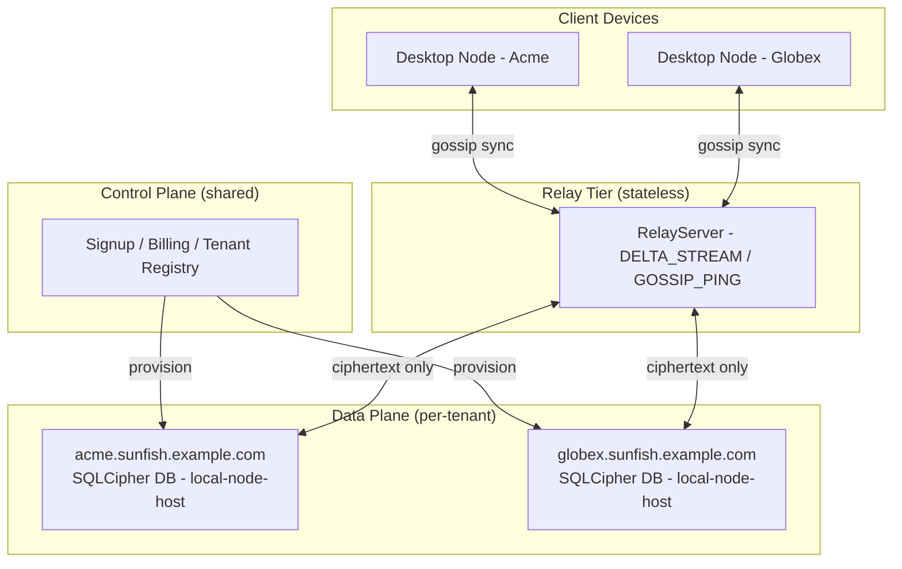

# Chapter 18 - Migrating an Existing SaaS

<!-- icm/prose-review -->

<!-- Target: ~3,500 words -->
<!-- Source: v5 §8, Sunfish accelerators/bridge/README.md, Sunfish docs/zone-b-migration-path.md -->

---

This chapter documents the migration path for a hosted SaaS product adopting a hybrid local-first deployment - Zone C, the comms mesh accelerator - without a flag-day cutover. The architecture is taken apart piece by piece while production keeps running, one component at a time, with the lights still on. Every phase gate below Phase 4 is reversible. The cost is engineering *discipline* to apply Ferreira's four-phase reversible model from Chapter 9 instead of the rewrite-everything approach. Rewrite-everything has killed more SaaS-to-local-first attempts than any technical obstacle ever has.

### Glossary (for readers entering here)

**Zone C** is the hybrid architecture - local-first data plane with a SaaS control plane for signup, billing, and cross-tenant coordination. Chapter 4 defines the full decision framework across three zones. **CRDTs** (Conflict-free Replicated Data Types) are data structures that merge concurrent edits deterministically without server coordination; Chapter 12 covers the engine. **AP-class records** tolerate brief divergence across peers and merge through CRDT (Conflict-free Replicated Data Type) semantics. **CP-class records** require linearizable writes under distributed lease coordination (Chapter 14). **Hosted-node peer** is a Harborline Shipyard (the open-source reference implementation, [github.com/ctwoodwa/Sunfish](https://github.com/ctwoodwa/Sunfish)) node that runs on server infrastructure alongside user-device nodes, participating in sync as a ciphertext-only peer. It holds encrypted deltas. It holds no decryption keys.

### When to Migrate: The Triggers

Teams do not migrate from SaaS to local-first on aesthetic grounds. Five triggers - and only these five - justify the engineering investment.

- **Compliance mandate received.** A customer or regulator requires that data reside on user-controlled infrastructure. Common triggers include the EU's Schrems II combined with GDPR (General Data Protection Regulation) Article 30. The UAE's DIFC (Dubai International Financial Centre) DPL (Data Protection Law) 2020 prohibits foreign-cloud regulated data for DIFC-licensed financial entities. India's DPDP (Digital Personal Data Protection) Act 2023, paired with the RBI (Reserve Bank of India) data localization circular, extends the same constraint. Russia's Federal Law 242-FZ extends it again. Parallel mandates across APAC (Asia-Pacific), Africa, and the Americas appear in Appendix F. Any one of these turns "nice to have" into "ship by the next procurement cycle or lose the account."

- **Data residency objection appearing in enterprise sales.** The sales team is losing deals at the data-sovereignty review. The architecture's relay-ciphertext-only guarantee answers this structurally rather than contractually - not in a vendor letter, in the wire protocol itself.

- **SaaS vendor reliability event or service termination.** In 2022, Adobe and Autodesk and Microsoft and Figma ([figma.com](https://www.figma.com/), the design tool) - and dozens of other Western SaaS vendors - suspended or terminated service across Russia and CIS (Commonwealth of Independent States) markets under sanctions enforcement. Hundreds of thousands of organizations lost access to their own operational workflows with days of notice. Organizations under import substitution mandates, or operating in jurisdictions where vendor-level compelled access is a documented threat model, treat this as Failure Mode 0. The vendor suspends service. The architecture must survive it.

- **Customer churn driven by data sovereignty.** Repeated loss of accounts citing "the data lives on your servers" as a concrete objection - not a hypothetical one.

- **Enterprise procurement review blocking adoption.** Procurement due diligence requires that the vendor relationship be replaceable without data migration. A managed relay that can be self-hosted - and a data plane that already is - passes this test. A cloud-first SaaS does not.

Run all five against actual customer conversations before any migration work begins. The migration is substantial. The justification must be real.

---

## Determine the Zone Before Writing a Line of Code

Run the five-filter framework from Chapter 4. Every filter asks the same underlying question. Does the value of this feature depend on coordinating state across users simultaneously, or does it depend on a single team managing their own data well?

Filter 1 asks whether data is user-owned or platform-owned. If the records belong to a specific team and that team's members are the only people who need to read and write them, the data passes Filter 1. Shared public feeds, aggregated analytics across all customers, and anonymized usage data do not pass.

Filter 2 asks whether the acceptable staleness window is minutes or milliseconds. A task board that reflects changes within 30 seconds is still useful. A financial exchange that reflects prices from 30 seconds ago is dangerous. If the staleness window is measured in minutes, the implementation is eligible for local-first. If it is milliseconds, it is not - for that record class.

Filter 3 asks whether conflicts are resolvable without human coordination. Text edits, task status, and user preferences all have natural CRDT semantics. Inventory reservations and seat assignments do not.

Filter 4 asks whether offline operation has value. A field team that loses connectivity mid-project still needs to record work. A real-time trading terminal without connectivity is simply broken. Offline value correlates directly with local-first fit.

Filter 5 asks whether the compliance posture allows data to leave the server. Some customers require data residency on their own hardware. Local-first delivers that naturally. Some regulations require server-side audit trails for every write - that constraint must be modeled carefully against the AP-class domain boundaries.

**Reading the results.** If every record class in the product fails Filter 1 or Filter 2, the architecture is in Zone B. Use Harborline Shipyard packages up through the Blocks layer and stop there - the local-first kernel is not the migration target. If the product has some record classes that pass all five filters and others that do not, the architecture is in Zone C. This chapter is for Zone C. Greenfield implementations that return Zone C from the framework should clone `accelerators/bridge/` directly - the migration path documented here is for teams with production workloads.

---

## The Zone C Accelerator Is the Reference Implementation

Clone `accelerators/bridge/` before the first planning meeting. The Zone C accelerator is the Harborline Shipyard comms mesh reference implementation, and it runs a working hosted-node-as-SaaS implementation: a traditional web layer handles signup, billing, and a browser-accessible shell per tenant, while per-tenant local-node-host processes hold the data plane. Study the three logical planes the accelerator separates before touching any existing schema.

**Control plane - shared across all tenants.** The control plane handles signup, billing, subscription-tier enforcement, admin backoffice, support tickets, and system status. It holds a tenant registry with exactly this shape per tenant: `{tenant_id, plan, billing, support_contacts, team_public_key}`. No team data lives in the control plane. This is not a convention. This is a hard constraint. If a content record appears in the control plane, that is a design violation to correct.

**Data plane - isolated per tenant.** Each tenant gets a dedicated local-node-host process, a dedicated SQLCipher database at a per-tenant path, and a subdomain (`acme.sunfish.example.com`). The hosted-node peer participates as a ciphertext-only peer. It holds encrypted deltas for catch-up-on-reconnect. It cannot decrypt without a team-issued role attestation. The team holds the keys. The server holds ciphertext. That separation is the whole architecture in one line.

**Relay tier - shared and stateless.** One RelayServer process - scaled horizontally - accepts sync-daemon transport connections from all tenants. It fans `DELTA_STREAM` and `GOSSIP_PING` frames scoped by team ID. It persists nothing. The relay is a message bus, not a database. The moment the relay is treated as a database, the architecture has already started to drift.



The Zone C accelerator also defines three tenant trust levels. The default - relay-only - means the operator never holds plaintext. An attested hosted peer is opt-in: the tenant admin issues a role attestation to the hosted peer, enabling backup verification and admin-assisted recovery. Some enterprise tenants run self-hosted nodes and use the comms mesh only for the control plane. The trust level the product requires is a decision made before the migration is designed.

---

## Five Architectural Decisions to Make Before Starting

These five decisions are cheap to make before migration begins and expensive to undo after Phase 2. Make them in this order, because each rests on the one above it.

**Decision 1: Per-tenant data isolation.** A shared Postgres schema with tenant-ID filter columns cannot migrate to the Zone C accelerator's per-tenant data plane without first separating the data planes. This is surgery. It touches every query, every index, every backup job. Do it first, before any local-first work begins. Wire every query through `ITenantContext` from `Harborline.Foundation`. This interface becomes the migration seam - how a Postgres-backed projection is swapped for a CRDT-backed one without rewriting the UI.

**Decision 2: Event tables over mutable fields.** A schema that stores domain state as last-write-wins field mutations has no natural path to CRDT-backed documents. A schema with append-only event tables for mutable aggregates has a mechanical migration path. Read the event rows. Emit equivalent CRDT operations. Validate the merged state against the prior projection. Every week of new mutable field columns added is a week of migration debt added to the bill. Prefer `TaskBody`, `TaskStatus`, `TaskAuditLog` over a single `Tasks` table with ten nullable columns.

**Decision 3: Separate AP data from CP data by table.** Zone C puts AP-class data - user-owned, eventually consistent - on CRDT documents on local nodes. CP-class data - server-coordinated, strongly consistent - stays on Postgres. A schema that intermingles the two needs a decomposition pass before either can migrate. Name tables by aggregate and class: `ProjectBody` is AP, `ProjectBillingRecord` is CP. Never store both in the same table - not for convenience, not for joins, not ever.

**Decision 4: Wire UI against block contracts.** `Harborline.Blocks.*` components are CRDT-state-aware by design. A task list backed by `Harborline.Blocks.Tasks` works identically whether the underlying data comes from a Postgres-backed projection or a CRDT-backed local document. The block's data contract is the same. Only the backing store changes. Wiring UI directly against ORM models or custom DTOs means every migration phase requires a UI rewrite. Wire against block contracts before the migration starts and the UI follows the data layer for free.

**Decision 5: Move business logic out of stored procedures.** Stored procedures execute in the database process. The local node kernel executes in the application process. Any business logic in a stored procedure cannot replicate to a local node. Audit stored procedures before the migration begins. Move validation, computation, and workflow logic into application-layer domain services. Leave only set-based data operations in the database. This step unblocks Phase 3.

---

## Four Migration Phases

The migration runs in four phases. The implementation can pause at the end of any phase indefinitely. Phases 1 through 3 are individually reversible. Phase 4 is a one-way door per workspace - run it incrementally, one workspace at a time.

### Phase 1 - Shadow Mode (Weeks 1–8)

**What.** Deploy a local node alongside the existing SaaS. The local node mirrors all data read-only. Writes still flow through the server API (Application Programming Interface). Users see faster reads. The server remains authoritative for everything.

**How.** Add `Harborline.Foundation.LocalFirst` to the service registration with shadow-read-only mode:

```csharp
// illustrative - not runnable (pre-1.0 API)
// AddSunfishLocalFirst() registers the local-first node. The mode - ShadowRead,
// ShadowDual, FullAuthority - is set through appsettings.json and read by the
// foundation layer at startup. The API below is illustrative; the configuration
// shape is stable even if the extension method signature evolves.
builder.Services.AddSunfishLocalFirst();
// appsettings.json: { "Harborline": { "LocalFirst": { "Mode": "ShadowRead" } } }
```

The foundation layer populates a local SQLite replica from the existing Postgres read model. UI read paths shift to the local replica. Write paths stay on the server API unchanged.

Wire a feature flag before shipping to production. The flag evaluates through the same mechanism the application already uses. Standard .NET `IFeatureManager` (Microsoft.FeatureManagement) reads from `appsettings.json`, Azure App Configuration, AWS AppConfig, or whatever flag provider the team runs (LaunchDarkly, ConfigCat, anything in that family). Harborline Shipyard does not ship a proprietary flag system. It expects the flag to be readable at the application layer and consulted by the foundation package before it switches reads to the local replica. The flag key `LocalFirst.ShadowMode` is a convention, not a reserved name:

```csharp
// illustrative - not runnable (pre-1.0 API)
// Register standard .NET feature management; Harborline.Foundation.LocalFirst
// consults the IFeatureManager at startup to determine whether shadow mode is live.
builder.Services.AddFeatureManagement();
// appsettings.json: { "FeatureManagement": { "LocalFirst.ShadowMode": true } }
```

This flag is the instant rollback path. If shadow mode causes a performance regression or a data inconsistency, flipping the configuration value off requires no deployment.

**Success criteria.** P95 read latency drops by at least 20%. No regressions in write consistency. The local replica stays within the AP staleness window - 30 seconds is a reasonable baseline for most task-management domains.

**Reversible.** Remove the `AddSunfishLocalFirst` registration. UI read paths fall back to the server. No data migration required.

---

### Phase 2 - Local Writes for Non-Conflicting Domains (Weeks 4–16)

**What.** Enable local writes for AP-class record classes - task body and drafts, personal notes, user preferences, attachments. The server remains authoritative for CP-class records: billing state and subscription limits, role membership, audit logs.

**How.** Introduce `Harborline.Kernel.Crdt` for AP-class aggregates. Route AP-class block writes through the CRDT engine. The server transitions to a relay role for AP-class data. It propagates CRDT deltas between nodes. It does not own them.

```csharp
// illustrative - not runnable (pre-1.0 API)
// Route AP-class domains (tasks, notes, attachments) through the CRDT engine;
// billing and roles remain server-authoritative - omit them here
builder.Services.AddSunfishCrdtEngine();
```

Identify AP-class domains by asking: if two users edit this record concurrently and both edits are preserved via merge, is the result acceptable? Task body edits merge cleanly. Seat reservation conflicts do not. The test is that simple, and that strict.

**Success criteria.** AP-class edits apply without a server round-trip - users see instant local feedback. CRDT merge resolves concurrent edits without data loss. CP-class records show no correctness regressions. Existing integration tests run unchanged against the CP-class write paths.

**Reversible.** Disable CRDT writes per domain. The server API resumes authority. The CRDT event log is preserved and can be replayed if local authority is re-enabled. The implementation can pause here indefinitely. Many products stabilize at Phase 2 and treat Phase 3 as a future option. That is a respectable place to stop.

---

### Phase 3 - Full Local Authority for New Projects (Weeks 12–24)

**What.** New projects or workspaces create as fully local-first nodes. Existing infrastructure becomes a relay peer. Existing workspaces stay at Phase 2 until their teams opt in to Phase 4.

This phase introduces the full local-node stack: gossip sync daemon, local SQLCipher database per workspace, device keypair issuance. It does not touch existing workspaces.

**How.** When a new workspace is created, provision the full kernel stack:

```csharp
// illustrative - not runnable (pre-1.0 API)
// AddSunfishKernelSync() registers the sync daemon (30-second gossip round interval default);
// AddSunfishKernelSecurity() issues device keypairs and configures role attestation;
// configuration option API is pre-1.0 and subject to change before release
services.AddSunfishKernelSync();
services.AddSunfishKernelSecurity();
```

`Harborline.Kernel.Security` issues device keypairs at first launch. Role attestations govern what the hosted-node peer can access. The hosted-node peer holds ciphertext for catch-up-on-reconnect. It cannot decrypt without a team-issued attestation. Configure BYOC (Bring Your Own Cloud) backup for new workspaces at provisioning time. The hosted-node peer is not a backup. It is a relay cache - see Chapter 16 for the storage guarantees. Teams that skip BYOC backup configuration discover this only during an incident. An incident is a bad classroom.

**Success criteria.** New workspaces operate at full fidelity without server connectivity. Gossip anti-entropy converges within the 30-second interval under the test topology. The hosted-node peer holds ciphertext-only - verify this with the comms mesh audit tooling before shipping.

**Reversible at the workspace level.** Individual workspaces that reach Phase 3 can be held there indefinitely. Phase 3 workspaces and Phase 2 workspaces coexist on the same infrastructure without conflict.

---

### Phase 4 - Gradual Backfill of Legacy Records (Weeks 20–Ongoing)

**What.** Progressively migrate existing Phase 2 workspaces to full Phase 3 local authority. This is opt-in per workspace. It is a one-way door. Do not run it fleet-wide.

**How.** For each domain aggregate, run the copy-transform migration job:

```csharp
// Illustrative - not runnable; validate against your Harborline Shipyard milestone
public class TaskBodyMigrationJob : IWorkspaceMigrationJob
{
    public async Task RunAsync(Guid workspaceId, CancellationToken ct)
    {
        var postgresEvents = await _eventStore
            .GetDomainEventsAsync(workspaceId, "TaskBody", ct);

        foreach (var evt in postgresEvents)
        {
            var crdtOperation = _transformer.Transform(evt);
            await _crdtLog.AppendAsync(workspaceId, crdtOperation, ct);
        }

        var postgresProjection = await _projections
            .GetCurrentAsync(workspaceId, "TaskBody", ct);
        var crdtProjection = await _crdtLog
            .ProjectAsync(workspaceId, "TaskBody", ct);

        _differ.AssertEquivalent(postgresProjection, crdtProjection);
    }
}

// The equivalence contract for _differ.AssertEquivalent, in the team's
// domain layer:
//   - All field values equal under domain-type comparison (strings exact,
//     numerics within a declared epsilon, booleans exact)
//   - Collection membership equal (set equality for unordered collections,
//     sequence equality for ordered lists; ordering differences in
//     list-of-task-comments are normalized before comparison using
//     causal ordering in the CRDT projection)
//   - Type coercions normalized: PostgreSQL timestamp with time zone
//     compared to DateTimeOffset under UTC; JSONB fields compared after
//     parsing to a common DOM
//   - Fails fast on the first divergence, with a diff object the caller
//     logs and surfaces to the migration dashboard
//
// If AssertEquivalent fails: hold the workspace at Phase 2, do not proceed
// to the authority switch. Investigate the delta using the Harborline migration
// diagnostic CLI (`sunfish migrate diff --workspace <id> --aggregate TaskBody`),
// which surfaces per-record divergences with the original and transformed
// events side by side. The repair path is typically a corrected transformer
// function; re-run the migration job idempotently until the diff is empty.
```

Run the diff validation before switching the write path. Switch only after the diff passes. Disable the Postgres write path for that workspace's AP-class domains. Run the workspace on Phase 3 for 30 days before treating the migration as stable.

**Success criteria.** Zero data loss confirmed by projection diff. The team self-reports equivalent capability - no features previously relied on are missing. The Postgres write path stays disabled for 30 days without rollback requests.

**Not reversible without re-migration.** The CRDT event log becomes the system of record. Re-migration to Phase 2 requires running the copy-transform in reverse. Expensive. Error-prone. A place no team wants to find itself. Run Phase 4 on a pilot workspace first. Wait 30 days. Then expand.

---

## Phase Transition Gates

Each phase transition requires an explicit decision - not a calendar event. Use this framing with the change advisory board.

| Transition | Gate question | Hard stop |
|---|---|---|
| Phase 1 → Phase 2 | Is P95 read latency improved with no write regressions? | Any CP-class write regression blocks the transition |
| Phase 2 → Phase 3 | Do all AP-class domains pass CRDT merge correctness tests? | Any data loss in merge testing blocks the transition |
| Phase 3 → Phase 4 | Does the projection diff pass for the pilot workspace? | Any diff failure blocks fleet rollout |

**The implementation can pause at Phase 2 indefinitely.** Phase 2 delivers real value - instant local writes, offline capability for non-conflicting domains, no server round-trip for the majority of user actions. Many teams reach Phase 2 and decide Phase 3 is not worth the operational complexity for their current customer base. That is a valid product decision. The architecture supports it. Phases 3 and 4 are on the table when the business case arrives.

---

## Common Failure Modes

Five failure modes recur across Zone C migrations. Name them in planning sessions so the engineering team can recognize them early - and recognize them by behavior, before they have a name.

**Failure mode 1: Server-side feature gates re-centralizing the architecture.** This is the most common drift pattern. Phase 2 ships. A product manager asks for a feature gate to roll out a new AP-class feature. An engineer adds a server call to evaluate the gate. Six months later the server is load-bearing for every write because the feature gate call became the pattern for analytics, A/B tests, and rate limiting. The team was not failing at architecture. They were failing at *discipline*. Every individual server call looked harmless. Wire feature flags through `Harborline.Foundation.FeatureManagement` from Phase 1. It evaluates flags locally against the node's role attestations - no server call required. Any AP-class decision routed through a server call re-centralizes that decision.

**Failure mode 2: Shared Postgres schema blocking per-tenant isolation permanently.** A shared schema with tenant-ID filter columns looks harmless at a few dozen tenants. At a few hundred tenants, the migration cost to per-tenant isolation is disproportionate - data volume, index rebuild time, and cutover risk multiply together. Once committed to a shared schema, reaching the Zone C accelerator's per-tenant data plane requires a migration project that rivals the original migration. Make this decision in week one.

**Failure mode 3: Relay mistaken for a backup.** The hosted-node peer stores ciphertext for catch-up. Teams that skip BYOC backup configuration assume the relay holds their data durably. It does not. The relay is a cache. It evicts. It does not guarantee retention. When a device is destroyed and the team tries to recover from the relay, they discover this constraint during the incident. Configure BYOC backup at workspace provisioning time in Phase 3. Make it non-optional in the provisioning workflow - make it the default the team has to override, not the option the team has to remember.

**Failure mode 4: Phase 1 shadow mode without a feature flag.** Shadow mode adds a read path. If that read path introduces a performance regression - a slow SQLite query, a deserialization bug, a race condition on startup - turning it off without a deployment requires the flag. Without the feature flag, code rolls back under pressure. Wire `LocalFirst.ShadowMode` as a `Harborline.Foundation.FeatureManagement` flag before Phase 1 goes to production. This takes 30 minutes and buys a 30-second rollback window.

**Failure mode 5: Business logic in stored procedures discovered in Phase 3.** Stored procedures execute in the database process. The local node kernel executes in the application process. If Phase 3 provisioning reveals that a workspace creation workflow calls a stored procedure that validates subscription limits and enforces naming rules, those cannot replicate to a local node. Stored-procedure extraction under migration pressure is avoidable by running the audit during Decision 5, before any migration sprint begins.

---

## What Harborline Shipyard Provides at Each Phase

Know which packages become available as the architecture advances through phases. Do not reach for a package before the architecture is ready for it.

| Package | Phase 1 | Phase 2 | Phase 3 | Phase 4 |
|---|---|---|---|---|
| `Harborline.Foundation` | Yes | Yes | Yes | Yes |
| `Harborline.UICore` | Yes | Yes | Yes | Yes |
| `Harborline.UIAdapters.Blazor` | Yes | Yes | Yes | Yes |
| `Harborline.Blocks.*` | Yes | Yes | Yes | Yes |
| `Harborline.Foundation.LocalFirst` | Shadow read-only | Shadow + local writes | Full | Full |
| `Harborline.Kernel.Crdt` | No | Yes (AP domains) | Yes | Yes |
| `Harborline.Kernel.Sync` | No | No | Yes | Yes |
| `Harborline.Kernel.Security` | No | No | Yes | Yes |

`Harborline.Foundation.FeatureManagement` belongs in every phase from Phase 1 onward. Wire it first.

---

## The Greenfield Case

Greenfield implementations - no existing data, no existing tenants, no migration debt - where the five-filter framework from Chapter 4 returns Zone C should clone `accelerators/bridge/`. It ships Zone C out of the box. The control plane, relay tier, and per-tenant data plane are already separated. The hosted-node peer ships ciphertext-only. The work is product configuration, not architecture construction.

The migration path in this chapter exists for teams with production workloads, existing schemas, and customers who cannot tolerate a flag-day cutover. Every phase delivers value independently. Phase 1 is deployable in a sprint. Phase 2 is deployable in a quarter. Phases 3 and 4 are available when the business case justifies them.

The phased approach allows adoption of as much local-first behavior as the product and customers can absorb, at whatever pace makes sense, without betting everything on a single rewrite.

---

## Next Steps

Chapter 19 covers what happens when a Zone C product reaches an enterprise customer with a security review, a procurement process, and a change advisory board. The migration phases in this chapter provide the architectural foundation. Chapter 19 provides the operational and compliance layer.

For the full specification of the sync daemon protocol, gossip anti-entropy, and the CRDT engine internals referenced in Phases 3 and 4, see Chapters 12, 13, and 14. For key hierarchy, role attestation, and the ciphertext-only invariant, see Chapter 15.
